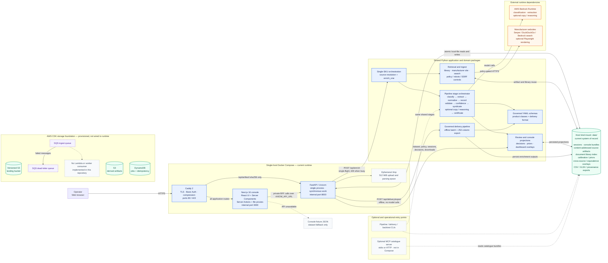

# AXIOM — Verifiable Product Intelligence for Industrial Commerce

> Every attribute has a source. Every claim has a proof. Every decision has a number attached to it.

AXIOM ingests fragmentary product information — a part number, an ERP description stub, a
supplier PDF, a manufacturer URL, a photo — and produces a complete, class-conformant,
unit-normalized, **citation-backed** product record, together with a formal statement of what
was verified, what was inferred, and what could not be established at all.

The design blueprint is in [`docs/AXIOM-Product-Intelligence-Blueprint.md`](docs/AXIOM-Product-Intelligence-Blueprint.md).

## Contents

- [Links and live resources](#links-and-live-resources)
- [Architecture](#architecture)
- [Wireframes and UX design](#wireframes-and-ux-design)
- [The thesis: build the trust layer, not the text layer](#the-thesis-build-the-trust-layer-not-the-text-layer)
- [Core principles](#core-principles)
- [Quickstart](#quickstart)
- [The Unilog delivery format](#the-unilog-delivery-format)
- [The review workspace](#the-review-workspace)
- [Measured results](#measured-results)
- [Repository layout](#repository-layout)
- [Pipeline stages](#pipeline-stages)
- [AWS configuration](#aws-configuration)
- [Build status](#build-status)

## Links and live resources

| Resource | Link |
|---|---|
| **GitHub repository** | https://github.com/varshith21-codes/Unilog |
| **Working prototype** (live console) | https://axiom.vectoredu.online |
| **Walkthrough video** | https://youtu.be/yRt9danXXc0?si=pbAx7Dpm3str6JV9 |
| **Architecture diagram** | [`docs/ARCHITECTURE.md`](docs/ARCHITECTURE.md) |
| **Deployment runbook** | [`docs/DEPLOY.md`](docs/DEPLOY.md) |
| **Wireframe atlas** (interactive) | [`docs/wireframes/unilog-wireframe-atlas.html`](docs/wireframes/unilog-wireframe-atlas.html) |
| **Wireframe contact sheet** (SVG) | [`docs/wireframes/unilog-wireframes.svg`](docs/wireframes/unilog-wireframes.svg) |
| **Design blueprint** | [`docs/AXIOM-Product-Intelligence-Blueprint.md`](docs/AXIOM-Product-Intelligence-Blueprint.md) |

> The prototype at [axiom.vectoredu.online](https://axiom.vectoredu.online) serves real,
> persisted pipeline output — every screen but the enrichment form reads bundles written by the
> pipeline, and every value on screen resolves to a citation you can click through to. The video
> at [youtu.be/yRt9danXXc0](https://youtu.be/yRt9danXXc0?si=pbAx7Dpm3str6JV9) walks the same path
> end to end.

## Architecture

The full runtime topology — the browser-facing Next.js BFF, the single-process FastAPI service,
the shared Python domain packages, the bind-mounted `data/` system of record, the external
Bedrock and web-retrieval dependencies, and the provisioned-but-not-wired AWS CDK storage
foundation — is drawn as a Mermaid diagram in [`docs/ARCHITECTURE.md`](docs/ARCHITECTURE.md).
Solid arrows are live runtime paths; dashed arrows are optional tooling, fallback behaviour, or
infrastructure that is provisioned but not connected to the current application.

[](docs/architecture.svg)

<sub>Rendered from [`docs/architecture.mmd`](docs/architecture.mmd) —
[SVG](docs/architecture.svg) · [PNG](docs/architecture.png). Regenerate with
`npx -y -p @mermaid-js/mermaid-cli mmdc -i docs/architecture.mmd -o docs/architecture.svg -b transparent`.
The Mermaid source is inlined below so it also renders directly on GitHub.</sub>

<details>
<summary>Mermaid source (renders inline on GitHub)</summary>



</details>

**Key architectural constraints** (full detail in [`docs/ARCHITECTURE.md`](docs/ARCHITECTURE.md)):

- **Next.js is the browser-facing BFF.** Server Components, Server Actions and route handlers call
  FastAPI on the private Compose network. The only browser-to-FastAPI exception is the
  hash-addressed artifact route proxied by Caddy.
- **The API is deliberately single-process.** Enrichment runs synchronously under a process mutex;
  there is no live queue, background worker, Redis or SQL database.
- **The bind-mounted `data/` directory is the current system of record.** It holds mutable review
  sessions, immutable content-addressed sources, dashboard projections, calibration state and
  delivery outputs.
- **Online and offline paths share domain code.** HTTP enrichment and operational CLIs converge on
  the same staged Python pipeline; upload-based delivery uses the deterministic governed delivery
  package and makes no Bedrock calls.
- **The CDK resources are future foundation.** S3, DynamoDB, SQS and the DLQ are defined, but the
  current API and pipeline have no adapters connecting them.

A step-by-step read of what each pipeline stage does is in [Pipeline stages](#pipeline-stages)
below.

## Wireframes and UX design

The console's fourteen screen families are documented as a low-fidelity wireframe atlas — a
technical blueprint rather than a visual comp, monochrome with a single blue annotation accent.
Each family carries desktop and mobile frames, tablet reflow notes, the exact source files that
implement it, and numbered annotations that state the one thing each screen must get right.

| Artifact | What it is |
|---|---|
| [Interactive atlas](docs/wireframes/unilog-wireframe-atlas.html) | The full browsable wireframe set with annotations and covered states |
| [SVG contact sheet](docs/wireframes/unilog-wireframes.svg) | Every frame on one scalable sheet |
| [Route map source](docs/wireframes/unilog-route-map.mmd) | Mermaid source for the console route graph |
| [State-flow source](docs/wireframes/unilog-state-flows.mmd) | Mermaid source for per-screen state transitions |
| [Coverage spec](docs/wireframes/coverage.json) | Machine-readable index of families, routes, annotations and covered states |
| [PNG renders](docs/wireframes/png) | Chrome-headless renders of every desktop and mobile frame |

**Canonical workspace navigation:** Operations → Enrich → Resolve → Process → Publish → Audit,
with Intelligence as a secondary destination.

### Screen families

| Family | Route(s) | Desktop | Mobile |
|---|---|---|---|
| Public landing | `/` | [png](docs/wireframes/png/public-landing-desktop.png) | [png](docs/wireframes/png/public-landing-mobile.png) |
| Marketing 404 | `* (outside workspace)` | [png](docs/wireframes/png/marketing-404-desktop.png) | [png](docs/wireframes/png/marketing-404-mobile.png) |
| Workspace shell | all workspace routes | [png](docs/wireframes/png/workspace-shell-desktop.png) | [png](docs/wireframes/png/workspace-shell-mobile.png) |
| Operations | `/operations` | [png](docs/wireframes/png/operations-desktop.png) | [png](docs/wireframes/png/operations-mobile.png) |
| Enrich | `/enrich` | [png](docs/wireframes/png/enrich-desktop.png) | [png](docs/wireframes/png/enrich-mobile.png) |
| Resolve queue | `/review` | [png](docs/wireframes/png/resolve-queue-desktop.png) | [png](docs/wireframes/png/resolve-queue-mobile.png) |
| Resolve detail | `/review/[sku]` | [png](docs/wireframes/png/resolve-detail-desktop.png) | [png](docs/wireframes/png/resolve-detail-mobile.png) |
| Process | `/pipeline` | [png](docs/wireframes/png/process-desktop.png) | [png](docs/wireframes/png/process-mobile.png) |
| Publish | `/delivery` | [png](docs/wireframes/png/publish-desktop.png) | [png](docs/wireframes/png/publish-mobile.png) |
| Audit list | `/certificates` | [png](docs/wireframes/png/audit-list-desktop.png) | [png](docs/wireframes/png/audit-list-mobile.png) |
| Audit detail | `/certificates/[sku]` | [png](docs/wireframes/png/audit-detail-desktop.png) | [png](docs/wireframes/png/audit-detail-mobile.png) |
| Intelligence | `/quality` | [png](docs/wireframes/png/intelligence-desktop.png) | [png](docs/wireframes/png/intelligence-mobile.png) |
| Legacy Review (FastAPI) | `:8000/` | [png](docs/wireframes/png/legacy-review-desktop.png) | [png](docs/wireframes/png/legacy-review-mobile.png) |
| Legacy Delivery (FastAPI) | `:8000/delivery` | [png](docs/wireframes/png/legacy-delivery-desktop.png) | [png](docs/wireframes/png/legacy-delivery-mobile.png) |

Overview renders: [atlas overview](docs/wireframes/png/atlas-overview.png) ·
[SVG contact-sheet preview](docs/wireframes/png/svg-contact-sheet-preview.png).

## The thesis: build the trust layer, not the text layer

Generating plausible product copy from a part number is a solved problem, and by 2026 every
PIM ships it. It is also the wrong problem. An industrial distributor cannot publish a
pressure rating that a model invented, because the downstream cost of a wrong spec is a failed
installation, a returned pallet, or a liability claim — not a bounced-back page view.

So the hard part is not producing values. It is knowing **which values you are allowed to
believe**, and being able to prove it afterwards. AXIOM is built around that:

| Instead of | AXIOM does |
|---|---|
| "The model is usually right" | A measured error bound on everything auto-published |
| Free-text enrichment | Evidence-or-null, enforced in the type system |
| A confidence number the model made up | Confidence estimated from independently checkable signals |
| "Human review recommended" | A queue ordered by failure mode, with the evidence on screen |
| A best-effort feed | A pre-flight gate that refuses to publish an unreviewed value |

## Core principles

1. **Evidence or null.** A specification value cannot be written without a verifiable evidence
   span. No evidence means a typed gap record, not a guess. This is enforced by a Pydantic
   validator, not by convention — discipline does not survive a deadline.
2. **Extraction and generation are separate subsystems.** Specs are extracted and proven.
   Marketing copy is generated, but constrained to reference only already-verified facts.
3. **Deterministic where determinism exists.** Unit conversion, check digits, dimensional
   consistency and arithmetic are code, not model output.
4. **Confidence is first-class and calibrated** against real reviewer outcomes.
5. **Everything is versioned and replayable** — prompt version, model ID, schema version,
   source document hash.

## Quickstart

Requires Python 3.11+ (Node 20+ only for the CDK app and the Next.js dashboards).

```powershell
python -m venv .venv
.\.venv\Scripts\Activate.ps1
pip install -e ".[dev,api,docintel,ingest]"

pytest -m "not live"                    # 1,167 tests, no AWS credentials needed
ruff check .
python scripts/check_console_types.py   # types.ts vs the Python models it mirrors
```

Everything above runs offline, and so do five of the entry points — supplier-file ingestion,
the quality cohort, part-number grammar induction, the cross-reference report, and the regression
gate make no model calls at all:

```powershell
# a messy supplier spreadsheet -> canonical fields, with the mapping remembered per supplier
python scripts/ingest_supplier_file.py data/samples/supplier-feed.csv `
  --supplier milwaukee --map "WT/EA (lb)=each_weight" --confirm --out data/ingest

# what enrichment changed about the catalogue, against the item master it started from
python scripts/run_cohort.py --write

# cross-source agreement, with scripted responses so the mechanism is visible for free
python scripts/cross_validate.py `
  data/samples/ba100.txt data/samples/ba100-catalog.txt --sku BA-100-075 --dry-run

# what a part number encodes, learned from examples and scored on held-out parts
python scripts/induce_grammar.py --ablation

# what else in the catalogue could ship instead, and why the rest cannot
python scripts/cross_reference.py --sku BA-100-100
python scripts/cross_reference.py --sku 77C-105R --against 77C-105   # one directional pair
python scripts/cross_reference.py --sweep                            # every ordered pair
```

The pipeline itself needs Bedrock:

```powershell
$env:AWS_PROFILE = "axiom"

# prove every cascade tier is actually invocable, and pin the model IDs
python scripts/preflight_bedrock.py --region us-east-2 --write

# run one SKU end to end and save a review session
python scripts/run_pipeline.py data/samples/ba100.txt `
  --sku BA-100-075 --brand "milwaukee vlv" `
  --include-optional --risk-budget 0.05 --save-session --out data/out
```

The source argument accepts a local path or an `https://` URL, and routes `.txt`, `.pdf` and
HTML to the right parser by sniffing content rather than trusting the extension.

That prints every stage — classification, extraction with quotes, normalization, validation
verdicts, the accept/queue decision per value with the feature that drove it, and the channel
pre-flight result. Artifacts land in `data/out/`: a signed certificate and one payload per
channel that passed pre-flight.

## The Unilog delivery format

The graded output. The client's format is fixed at **252 columns in an order we do not control**,
so a file whose columns do not match theirs is unusable regardless of the enrichment behind it.
Blueprint [Part 17](docs/AXIOM-Product-Intelligence-Blueprint.md#part-17--the-unilog-delivery-contract)
records what the real dataset pack demands and which earlier design decisions it overrides.

Both steps below are **fully offline and make no model calls** — classification is the
deterministic retrieval pass — so they run in CI on every push:

```powershell
# a 1,000-row supplier item master -> a 252-column delivery CSV plus a provenance sidecar
python scripts/export_delivery.py "Unihack_ Sample Dataset - Input.csv" `
  --mpn PDSH4816AF --mpn WDTS7024RZ --out data/delivery

# field-level accuracy against the client's own known-good rows
python scripts/score_delivery.py data/delivery/Unihack__Sample_Dataset_-_Input.delivery.csv
```

### Two measurements, because they answer different questions

```powershell
# the system as it stands: six columns in, no documents attached
python scripts/export_delivery.py "Unihack_ Sample Dataset - Input.csv" `
  --mpn PDSH4816AF --mpn WDTS7024RZ --out data/delivery

# the same pipeline with correct attributes supplied, isolating everything downstream of extraction
python scripts/export_delivery.py "Unihack_ Sample Dataset - Input.csv" `
  --mpn PDSH4816AF --mpn WDTS7024RZ `
  --golden data/golden/unilog_dishwashers.yaml --out data/delivery/supplied
```

|  | unseeded | attributes supplied |
|---|---|---|
| **exact match** | **56/134** | **107/134** (79.9%) |
| over-filled | 0 | 0 |
| wrong values | 0 | 1 |
| character limits | PASS | PASS |
| attribute grid | 32/62 | **62/62** |
| five descriptions | 0/10 | **10/10** |
| identity, taxonomy, citations, echo | partial | **complete** |

Both are pinned — `tests/test_delivery_scoring.py` and `tests/test_delivery_golden.py` — and both
run in CI. Read them together or not at all:

- **The unseeded run is the honest state of the system.** 56/134, and of that, 54 is scaffolding
  and 2 is enrichment (`Material: Stainless Steel`, read from the `SS` in
  `"...Dishwasher SS - Display Only"` and citing that substring). Every one of the 78 failures is
  `missed`, not `wrong`.
- **The supplied arm is the ceiling retrieval is working towards.** Its attribute values are
  transcribed from the client's own answer sheet, so it proves *nothing* about extraction and
  everything about the projection, the unit handling and the description formulas. Quoting it as
  the result would be dishonest; omitting it would hide a working capability behind a blocked one.

What the arm establishes concretely: the attribute grid is exact, all five deterministic
descriptions reproduce the client's strings character for character, and the single wrong cell is a
vocabulary gap the missing LOV file would settle (they write `UL Listed`, our shared approvals enum
canonicalises to `UL`, and both are correct in their own category).

The 26 remaining gaps in the arm are all accounted for: 4 client-internal keys that a six-column
input cannot yield, 11 marketing feature bullets and 1 marketing description that are genuinely
generative manufacturer content, 8 asset filenames deliberately not seeded because none was fetched,
and 2 flags.

### The five rewrites are formulas, not generation

The guide calls this most of the task: *"the same product information is rewritten five times at
five different lengths and casings."* Four of the five turn out not to be generation at all. They
are deterministic assembly from established values, driven by recipes in `schema/descriptions/`,
and they reproduce the client's own strings exactly:

```
INVOICE_DESC   DISHWASHER LEG 5 SST 120V 15A 50-1/4IN            38 chars, <=40, CAPS
MOBILE_DESC    Rheem Manufacturing FRIGIDAIRE, Dishwasher, ...   75 chars, 60-80
SHORT_DESC     FRIGIDAIRE® Professional Series PDSH4816AF ...   115 chars
RETAIL_DESC    Professional Series Dishwasher, Leg Mounting...   75 chars
LONG_DESC1     FRIGIDAIRE® Dishwasher With CleanBoost™, ...     390 chars
```

That matters for three reasons. A template cannot introduce a fact, so the claim-check problem
disappears rather than being solved. Character limits are satisfied by construction rather than by
asking a model nicely. And the same product yields the same string every run, which is what makes a
category's titles consistent enough for on-site search to work.

The one non-obvious mechanism was **forced by the client's data, not chosen**. When a component
does not fit the budget the renderer skips it and tries the next, rather than stopping:

```
row 1   DISHWASHER LEG 5 SST 120V 15A 50-1/4IN    38   takes depth, omits 47DBA (would be 44)
row 2   DISHWASHER BLTLN SST SST 120V 10A 41DBA   39   omits 50-3/16IN (43), then takes 41DBA
```

Row 1 keeps the depth and drops the sound level; row 2 does the reverse. No stop-at-first-overflow
renderer can produce both, and no fixed component order per row would be a formula.

A **completeness gate** stops this producing fragments. With only a material known, the invoice
recipe would assemble `DISHWASHER SST` — which scores as a *wrong* value where an empty cell scores
as *missed*, and tells a picker less than the part number printed beside it. Each recipe declares
how many components it needs, and below that it withholds and says why.

### Real extraction, with no model in the loop

The supplied arm above proves the projection works but supplies its own facts. This is the third
measurement, and it is the one where facts are *read*: attach manufacturer documents and the
extractor takes values straight out of the page layout. No model, no credentials, no network.

```powershell
# accuracy against hand-read ground truth: 3 datasheets, 15 SKUs, one of them a real PDF
python scripts/score_extraction.py

# the same extractor through the delivery export, end to end
python scripts/export_delivery.py data/samples/valve-feed.csv `
  --document data/samples/ba100.txt `
  --document data/samples/ap77c.pdf `
  --document data/samples/gv200.txt `
  --out data/delivery/valves
```

| | |
|---|---|
| **agrees with a human reading** | **115** |
| **disagrees** | **0** |
| **produced where ground truth says absent** | **0** |
| not extracted | 112 |
| absences respected | 85 |
| precision | **115/115 (100%)** |
| coverage | 115/227 (50.7%) |

Precision is asserted absolutely and coverage as a floor, because reading more of a document is an
improvement and reading less is a regression. The 112 not-extracted are the coverage gap, reported
separately from disagreements on purpose: "did not read it" and "read it wrong" are different
problems with different fixes, and averaging them into one accuracy figure hides the second.

Through the delivery export the same three documents yield **24 extracted values across 3 parts** —
25 cited cells once the derived UOM columns are counted — taking `valve-feed.csv` from **39 to 56 of
252 columns** populated, with `withheld 0` and every cell citing a specification line or an
ordering-table cell that a reviewer can highlight.

**Two paths, two vocabularies.** Manufacturer documents state facts in two shapes, and conflating
them produces confident errors:

- **Spec lines** — `Body Material .......... Bronze C84400` — matched against an attribute's name
  and its declared `spec_labels`, cited to `p1:l14` with the bounding box tightened to the value
  fragment.
- **Ordering tables** — the row whose part number equals the target — matched against `name` and
  `table_headers`, cited to a cell reference like `t1:r4:c3`. Higher confidence (0.94 vs 0.90),
  because both coordinates are computed rather than judged.

`spec_labels` and `table_headers` are separate fields because a real document forced them apart.
`gv200.txt` has a column headed `Handwheel` holding `Lever`/`Tee` — correctly bound to
`handle_type` — and also a line reading `Handwheel ....... Malleable Iron`, which is the handwheel's
*material*. One shared vocabulary gave `handle_type = Malleable Iron`: cited, plausible, wrong.

**The golden set caught three defects that looked like successes.** Each produced output that was
correctly cited and would have survived every integrity check downstream:

1. **Size-scoped values.** `Operating Torque ..... 18-22 ft-lb (1/2" size)` was being emitted for
   all four BA-100 sizes. Genuinely present, correctly quoted, wrong for three of the four parts —
   and the golden set records torque as absent for every one. Fixed by learning the target's
   `nominal_size` from the ordering table *first*, then filtering size-qualified lines against it,
   and refusing when the size is unknown. Four fabrications to zero.
2. **The wrong document.** Every row was read against every attached document, so specifications
   crossed between products. This is the failure nothing downstream can catch, because the quotes
   verify perfectly — they are just quotes about another product. Fixed with a relevance guard that
   requires the document to name the part before any value is read. On the three-document valve
   feed, running `require_sku=False` to reproduce the old behaviour: **35 values became 24, of which
   11 were surplus and 6 were actively wrong** — `T-113-100`, a NIBCO bronze gate valve, was reading
   `Bronze C84400`, `NPT threaded` and `366 degF` off the Milwaukee ball-valve sheet because it was
   parsed first. `scripts/score_extraction.py` runs a second arm offering every part all three
   datasheets specifically to keep this fixed; the two arms must report identical numbers.
3. **Prose read as a specification.** `Installation: the valve must be supported independently...`
   split cleanly into a label and a value. Fixed by rejecting values that open with a word no
   specification starts with (`the`, `must`, `see`, ...). The opener is the signal rather than the
   length, because an overflow field legitimately holds eleven words.

What this does *not* cover: prose, footnotes, and qualified claims. Those are what the model path is
for. The point of this path is that everything a document states plainly can be read for free, with
a citation, and audited by anyone with the repo and no AWS account.

### Where the remaining facts have to come from

Three sources. One is now reachable offline, one is reachable with credentials, one is blocked:

| Source | Yield on 1,000 rows | Yield on the 2 scored rows | Status |
|---|---|---|---|
| The description string | **445 cells** | 2 cells | works; capped by classification coverage (below) |
| Manufacturer documents, by layout | all stated plainly | all stated plainly | **works offline** — 115/115 precision on 3 real datasheets |
| Manufacturer documents, prose and footnotes | the rest | the rest | needs Bedrock credentials; retrieval also blocked on JS-rendered pages and >10MB PDFs |
| LOV / brand / UOM masters | brand, approvals, vocabularies | `BRAND_NAME`, `Standard/Approvals` | 8 missing files |

The documents row is split because the two halves have entirely different costs and failure modes.
Reading a labelled line off a datasheet needs no model and cannot hallucinate; reading a paragraph
does and can, which is why the evidence contract exists for the second and not the first.

**78% of the 1,000 descriptions carry recoverable attribute content** — voltages, wattages,
dimensions, fractions, finish codes — and the bottleneck was never the extractor. It was that a row
with no class has no attribute for a matched token to bind to. `axiom.extract.description` is
class-scoped on purpose: without that guard, `"24 in W"` in the client's own ground truth reads as
24 watts.

Adding one class demonstrates the size of that effect. Lighting is the largest cohort at 208 rows,
and with it in the schema:

| | before | after |
|---|---|---|
| rows classified | 10 | **214** |
| values extracted from descriptions | 8 | **445** |
| columns populated | 31 | **40** |
| rows classified without a lighting term in the source | — | **0** |

The 445 values are technology 126, wattage 107, base 89, form 69, shape 37, colour 10, material 7 —
each citing the substring it was read from. Wattage arrives through the quantity path because it
carries its own unit; the enums arrive through `schema/abbreviations.yaml`, which is the only route
from a description to an enum and the reason a lighting row could classify and still yield nothing
until those entries existed.

Two things were deliberately left undone, and both are tested to stay undone.
`schema/descriptions/` holds the five rewrite formulas, reverse-engineered from the client's own
dishwasher strings character by character; there is no labelled lighting row anywhere in this
repository, so a recipe here would be an invented template. And `27k` is trade shorthand for
2700 K — reading it literally gives 27 K, colder than liquid nitrogen — so the attribute is
declared with a `plausible_range` starting at 1500 to refuse the literal reading, and the expansion
waits for ground truth. A systematic 100× error across 208 rows is worse than 208 blank cells.

The remaining cohorts are abrasives (154 rows), decking (128) and power tools. Each is YAML rather
than code, with one measured constraint noted under Known gaps: the classifier's dominance threshold
now has 0.0104 of headroom and drift has run at about 0.02 per class, so the fifth class needs the
threshold re-measured in the same commit.

### Why the delivery format does not break "evidence or null"

The format asks for ~79 populated columns from an input of six columns and no attached document.
Run naively against the publish gate, the honest output is an *empty file*. The resolution is not
to weaken the gate but to notice that these cells do not all make the same kind of claim, so every
column declares a provenance class and each gets a different rule:

| Class | Claim being made | Gate |
|---|---|---|
| `passthrough` | "you sent us this" | none needed |
| `derived` | a deterministic function of established data | inherits its input's provenance |
| `extracted` | read off a manufacturer source | **full gate: evidence span required** |
| `generated` | composed from established cells only | claim-checked, may not add facts |
| `unavailable` | cannot be established | always emitted empty |

Every populated cell records its class, confidence and citation in the sidecar, so the CSV is
auditable cell by cell. That is the Enrichment Certificate projected onto the client's columns.

Three things were built and then deliberately declined, because each would have raised the score
by inventing data:

- **`UNSPSC`** — we hold a code per class; the client leaves the column blank and the guide names
  that as a known gap in *their* data. Filling it would diverge from the expected output to look
  more complete.
- **`BRAND_NAME`** — ground truth expects `FRIGIDAIRE®`, which appears nowhere in the input row.
  All three brand columns are sentinels and `Part_Manuf` names a buying co-op. So it is left blank
  pending retrieval rather than approximated.
- **Asset filenames** — the convention is derivable (`FRIGIDAIRE_PDSH4816AF.jpg`), but emitting a
  filename asserts the file exists. Names are written only for assets actually fetched.

`over-filled 0` is the assertion that records those decisions, and CI fails the build if it moves.

## The review workspace

```powershell
$env:PYTHONPATH = "packages;."
python -m uvicorn apps.api.main:app --port 8000
# open http://127.0.0.1:8000/
```

The workspace exists to make a decision take seconds. That imposes one hard requirement:
**the evidence has to be on screen next to the value.** A reviewer who has to open the source
PDF and hunt for a number is doing the original job by hand, and the claimed speed-up is gone.
So a session carries the source text alongside the values, with every citation resolved to a
page, a line, and where applicable an exact table cell.

The queue is ordered **by failure mode first**, then by ascending confidence. Working one
reason code at a time — every unverified citation, then every blocking rule failure — is much
faster than walking SKU by SKU, because the reviewer holds one question in mind across a run.

Every decision folds back into the per-attribute and per-supplier priors, which feed confidence
estimation, which moves the auto-accept threshold. The response to a decision reports the prior
movement, so the flywheel is visible rather than asserted. Priors are shrunk toward neutral in
proportion to sample count: one accept does not earn an attribute a confident prior.

| Endpoint | Purpose |
|---|---|
| `GET /api/health` | Session and bundle counts, whether calibration exists |
| `GET /api/sessions` | Every session on disk with queue counts by reason |
| `GET /api/session/{sku}` | Full session: items, evidence, validations, source pages |
| `POST /api/session/{sku}/decision/{attr}` | Accept / reject / correct; returns prior movement |
| `GET /api/policy?epsilon=` | The risk dial: threshold, coverage, and the full risk-coverage curve |
| `GET /api/console/dataset` | Everything the dashboards render, with review decisions joined in |
| `GET /api/console/stats` | Counts only — cheap enough to poll |
| `GET /api/artifact/{sha256}` | The stored source document itself, so the evidence viewer can render the real page |

`/api/artifact/{sha256}` is addressed by content hash, never by path. A 64-lowercase-hex validation
is traversal-proof in a way that sanitising a caller-supplied path is not: the accepted alphabet
contains no separator and no dot. The file suffix is discovered by globbing the store rather than
taken from the caller, and the content type comes from an allowlist of what the pipeline ingests —
an unrecognised suffix is refused with a 415 rather than served under a guessed type. Supplier HTML
is deliberately served as `text/plain`, because `inline` plus `text/html` would let a supplier page
run script on this API's origin, and `nosniff` cannot help when the declared type is the dangerous
one. `.partial` files, which are writes that crashed mid-flight, are excluded — their hash claims
complete content they do not have.

This is the only endpoint that returns raw supplier bytes rather than a derived projection, which
makes the missing authentication matter more here than elsewhere: those bytes may be licensed.

`/api/console/dataset` reports the policy the bundles were **actually decided under**, not a
freshly computed one. `/api/policy` is the separate what-if dial. Serving a different threshold
than the one that produced the accept/queue decisions would make every score badge in the UI
disagree with its own explanation.

**The API is unauthenticated.** It is bound to localhost for the demo and reads and writes
local files. Anything beyond a laptop needs an authentication layer in front of it, plus tenant
scoping on the session directory — `_session_path` currently guards only against path
traversal, not against cross-tenant access.

### The console

```powershell
# terminal 1 — the API
$env:PYTHONPATH = "packages;."
python -m uvicorn apps.api.main:app --port 8000

# terminal 2 — the console
cd apps/console
npm install
npm run dev          # http://localhost:3000

npm test             # 212 component and library tests (Vitest + React Testing Library)
npm run typecheck
npm run check:contrast
```

The list views — Resolve and Audit — are paged at 50, and both state the range and the total
(`Showing 51–100 of 1,001`). Paged rather than truncated: a capped list is indistinguishable from a
short one, so a record on page eleven would simply cease to exist as far as the UI is concerned.
Neither `[sku]` route is prerendered, because the dataset is fetched `no-store` so a reviewer's
decision takes effect immediately — enumerating a thousand part numbers into
`generateStaticParams` asked the build to prerender pages it could never reuse, and then failed at
runtime for any part number that had not existed when the build ran.

The component tests target the branches where being wrong would mislead a reviewer about their own
data rather than the layout: whether the formal-verification panel can tell *not checked* from
*checked and clean* from *the solver returned an error*, whether a stale catalogue reads as
superseded rather than as a conflict, whether the cohort refuses to vouch for a lift when its
control arm moved, and whether the cross-reference reads *cannot be determined* as a data gap rather
than as a rejection. There is deliberately no coverage threshold — a number pushes effort toward the
easy 80% and away from the handful of branches that matter.

Seven screens: a portfolio overview (quality scoreboard, cost meter, interactive risk dial), the
single-SKU enrichment form, the pipeline replay, the review queue, the per-SKU review workspace with
the evidence viewer and the cross-reference beneath it, the enrichment certificate, and the Quality
Index page carrying the before/after cohort. All but one render **real pipeline output** the API
serves from bundles written by `run_pipeline.py --save-session`, `export_console_catalogue.py` or
`POST /api/enrich`, and decisions made in the workspace post back and persist. No writer invents a
value; the difference between them is the source, and therefore how much there was to read: a
datasheet, one row of an item master, or a typed submission. `/enrich` is the exception in one respect
only — it *causes* a run rather than reading one.

**`/pipeline` replays a run rather than performing one.** It shows the stages a recorded run went
through — ingest, parse, classify, extract, normalize, validate, decide, certify, syndicate, plus
*explode variants* for a SKU cut from an ordering table and *generate copy* for a run that produced
any — each with the numbers that run actually produced, revealed in sequence. There is no Run button
and no upload, which is a deliberate reading of the blueprint's own demo hygiene note: cache the
scripted path, because conference WiFi will fail. A single frontier escalation is thirty seconds of
dead air in a seven-minute slot.

### `/enrich` — one product, from a part number

Every other entry point needs a file. `POST /api/delivery/export` filters rows already present in an
uploaded item master; `run_pipeline.py` refuses to start without a source document. Somebody holding
a part number, a manufacturer name and a link to the datasheet had to build a six-column CSV first.

```powershell
# This endpoint needs credentials, unlike every other one. No environment variable required: the
# API resolves the profile itself (see `resolve_profile`), so this works from a plain shell.
python -m uvicorn apps.api.main:app --port 8000

# Set AXIOM_AWS_PROFILE only to choose between accounts explicitly.
$env:AXIOM_AWS_PROFILE = "axiom"

# Then open http://localhost:3000/enrich, or — two fields, nothing else:
curl -X POST http://127.0.0.1:8000/api/enrich -H "Content-Type: application/json" -d '{
  "mpn": "43911BK",
  "manufacturer": "Kichler Lighting (KICLI)"
}'
```

**On credentials, because this wasted real time.** With no `AWS_PROFILE` set, boto3 selects the
profile literally named `default`. A `default` profile that exists in `~/.aws/config` — which gives
it a region, so it looks configured — but has no entry in `~/.aws/credentials` produces
`NoCredentialsError` on a machine where working credentials sit right beside it under another name.
The error reads "Unable to locate credentials", which sounds like *none are configured* rather than
*the wrong one was selected*.

So the API resolves the profile rather than inheriting it: an explicit `AXIOM_AWS_PROFILE` or
`AWS_PROFILE` always wins; failing that the ambient chain is used when it resolves, which is what
keeps instance roles working on EC2 and ECS; failing both, the single named profile that *does*
resolve credentials is used and announced on stderr. Only when there is exactly one candidate —
choosing between two would be guessing at which account to bill. And the 503 now lists every profile
and whether it resolves, so the next occurrence diagnoses itself.

**This is the one screen in the console that spends money.** Everything else reads persisted output;
this runs the online pipeline — two real Bedrock calls per submission, three with copy generation.
The cost is on the page header, on the submit button, and measured in the result, because a form that
bills quietly is a form somebody will hold down.

Required: **a part number and a manufacturer, and that is genuinely enough.** Optional: a description
and an `https://` URL.

Two fields are sufficient because the form is wired to `axiom.retrieve`, so it goes and finds the
document itself:

1.  **The library first.** A stored document that already covers this part means **no request at
    all**. `data/library/index.json` currently indexes 79 manufacturer documents covering 121 part
    numbers, and it also records the 999 parts it has checked and found *absent* — so a negative
    answer is paid for once instead of re-fetched. Retrieval is a one-time cost per document, not per
    part, and this is where a catalogue stops being one fetch per row.
2.  **The manufacturer's own site**, read through the search form the site published — no search API
    and no key. This works for a manufacturer declared in `schema/sourcing.yaml` (57 of them, with
    real domains), because that is where the domain comes from.
3.  **The open web, on by default and needing no key.** `axiom.retrieve.search_duckduckgo` queries
    DuckDuckGo's lite interface, takes the links and discards every snippet. This is the arm that
    reaches a manufacturer nobody has declared, which is the case the other two cannot serve at all.

None of that calls a model. It is HTTP and parsing, policy-gated before every request — marketplaces,
mass retail, distributors and aggregators are refused, `robots.txt` is honoured, requests to one
origin are spaced. So retrieval spends bandwidth where extraction spends tokens, and it is the
cheaper half of the run: reading a real datasheet is the difference between thirteen gaps and
thirteen cited values.

A worked example, part number and manufacturer only, no description and no URL:

```
mpn='43911BK'  manufacturer='Kichler Lighting (KICLI)'

retrieval    found in the library, 0 requests
             https://www.kichler.com/products/indoor-lighting/pendants/avery-pendant-43911bk
classify     LGT.LMP.GEN (retrieval_decisive)
extract      8 requested, 3 values, 100% citation coverage, $0.000391

  luminaire_form   Pendant          from 'Avery Pendant'
  product_series   Avery            from 'Avery Collection'
  wattage          40 W             from 'Wattage: 40 W'

delivery     30/252 columns, 3 cited        certificate ec_1c54759426e2, signature verified
```

A second worked example, the one the open-web arm exists for. `Frigidaire` is **not** declared in
`sourcing.yaml`, so steps 1 and 2 have nowhere to look:

```
mpn='PDSH4816AF'  manufacturer='Frigidaire'   (no description, no URL)

query        "Frigidaire PDSH4816AF specifications datasheet"
candidates   4 (2 refused by policy: ajmadison, us-appliance)
fetched      linqcdn.avbportal.com/documents/490513f4-….pdf   3 pages, 2 tables
classify     APP.KIT.DISHWASHER.BUILTIN
extract      8 values, 100% citation coverage, $0.000645

  sound_level          47 dBA            from 'Sound Level 47 dBA'
  voltage_rating       120 V             from 'Voltage Rating 120 V'
  amperage_rating      15 A              from 'Amps @ 120 Volts 15 Amps'
  depth_with_door_open 50-1/4"           from 'Depth With Door Open 50 1/4"'
  wash_cycle_count     8                 from 'Number of Cycles | 8'
  primary_material     Stainless Steel   from 'Tub Material Stainless Steel'
  finish_color         Stainless Steel   from 'Available Colors: Stainless Steel'
  mounting_type        Built-in          from '24" Stainless Steel Tub Built-In Dishwasher'
```

Eight cited values against **one** from the description-only run on the same part. That difference is
the argument for retrieval in a single line.

When retrieval finds nothing the run says so and names the remedy ("no manufacturer domain is
declared for 'X'; add it to `schema/sourcing.yaml`") rather than reporting a dead end, and falls back
to treating the submission as its own source.

### On the search provider, and its limits

Three things about `search_duckduckgo` that are load-bearing rather than incidental.

**The honest User-Agent is required, not merely preferred.** The intuition is backwards here: a
spoofed `Mozilla/5.0` gets HTTP 202 and an anti-bot challenge from that endpoint, while the project's
own `USER_AGENT` — which says what this is and who to contact — gets HTTP 200 and results. So the
honesty `ingest/web.py` argues for on principle turns out to be the only thing that works. Do not
"fix" this by adding a browser string; there is a test pinning it.

**It is a public HTML interface, not an API with a usage agreement.** It is used the way a person uses
it — one query per part number, honestly identified, spaced two seconds apart, link taken and page
left, no result text stored. That is a defensible reading and it is not a licence. Keep the spacing,
and treat the provider as replaceable: `SearchProvider` is one method wide precisely so swapping in a
paid API is a one-line change. `AXIOM_SEARCH=off` disables it; `AXIOM_SEARCH=bedrock` selects the
Bedrock Web Search arm instead.

**Bedrock Web Search is not usable on every account, which is why it is not the default.** It is a
server-side tool on the OpenAI Responses API, and that API accepts only the `openai.gpt-5.x` family —
tested against every model in one real account, where `nvidia.nemotron-*`, `zai.glm-*`, `qwen.*`,
`deepseek.*`, `minimax.*` and `moonshotai.*` all return *"does not support the `/openai/v1/responses`
API"* and every `openai.gpt-5.x` returns *"not available for this account"*. A model appearing in the
Bedrock console catalogue means it is purchasable, not that the account is entitled to it or that it
supports that API. The extraction cascade is unaffected — it runs on GLM and Qwen through Converse.

`retrieve=false` turns all of it off for a fully offline, deterministic run. *Then* a description or
a URL is required again, and the refusal is the honest one: with nowhere to look and nothing to read,
classification abstains, extraction has nothing to cite, and the only output is an identity-only row
produced after paying for two model calls. The form says which field is missing rather than just
greying out the button.

One subtlety worth knowing, because it cost a debugging pass. Classification reads the most specific
statement of what the product *is*: the description when there is one, otherwise the document's title
block. On a scraped **web page** that title block is navigation chrome — `Menu / Ellipsis / Chevron /
Grid` — which matches nothing in the schema, so classification abstained and extraction requested
zero attributes off a perfectly good retrieved page. The whole document is now the fallback, and it
classified that page decisively. The fallback is free in exactly the case it fires: an abstention on
vocabulary grounds happens before any model call.

**The two source shapes are not equal, and the UI never flattens them.**

| | Source document | Citation says | Evidential weight |
|---|---|---|---|
| **URL supplied** | The fetched datasheet, hashed | page and line | The manufacturer *states* this |
| **No URL** | The typed fields themselves, hashed, `submission:{mpn}` | the field it was read from | You told us this, at this hash, at this time |

Both are real provenance. A submission is the weaker one, and every screen that shows a value from
one says so. Supply both and the datasheet is primary: the description still runs through the
deterministic pass, and the document's values **supersede** it — `ProductRecord.add_value` supersedes
rather than appends, so the weaker reading stays in the record's history instead of colliding with
the stronger one. That ordering is the one `axiom/delivery/batch.py` already documents as
load-bearing, and it is enforced inside `run_stages` rather than left to a caller to remember. A
description-derived value in a run with a URL cites the *submission*, not the datasheet, because the
text is not in the datasheet — citing it would be exactly the false citation this system exists to
prevent.

The result is rendered on screen (stage cards for the run that just executed, the quality index, the
queue), downloadable as CSV or XLSX with a per-cell provenance sidecar, and **persisted** — the SKU
joins the corpus, so it appears in Resolve, in Audit, on the dashboards, and is replayable from
Process. The delivery files are written when the run finishes, not on download: a download that
re-ran the pipeline would spend two more model calls to produce bytes we already had.

An already-enriched part number is a **409**, not a silent overwrite. Re-running replaces the review
session and any decisions recorded against it, so it takes a deliberate second press. Same principle
as `run_pipeline` refusing `--dry-run --save-session`.

**Two things are materially worse on this endpoint than on the read-only routes, and neither is
closed by anything in the code:**

- **No authentication, on a route that spends money.** A sharper version of the gap already
  documented on `/api/delivery/export`, which only spends CPU. A 4,000-character description cap, an
  8 MiB document ceiling and a single-run mutex bound what one caller can spend before somebody
  notices. They do not prevent it. Auth goes in front of this before anything else.
- **Server-side request forgery.** This fetches a caller-supplied URL from inside your network.
  `axiom.ingest.web` refuses non-`https` schemes, loopback and private literals, and now — when
  `verify_public_address` is set, which this path sets — resolves the hostname and refuses any
  non-public answer, re-checking at every redirect hop through a custom opener. That closes the
  hostname-indirection hole the module's own docstring flagged. It does **not** close the race: DNS
  is re-resolved when the socket is opened, so a short-TTL record can answer publicly to the check
  and privately to the connection. This needs an egress policy, not just a library check.

The stage list is derived, not fixed, so the count moves with the run. `BA-100-075` as committed
replays ten stages: it has generated copy but is not part of a series.

That trade creates the one real hazard on the screen, and it is not technical. A sequence of stage
cards completing looks exactly like work happening now. So the heading says replay, the run's own
timestamp is shown beside it, and the elapsed figures are labelled *recorded then, not now* —
because the only measurements that exist are the model calls (`extraction.latency_ms` and the run
total in `cost.latency_ms`). The deterministic stages were never instrumented, so their timing reads
as absent rather than as zero. Staging is fixed at 300ms per card rather than proportional to the
real durations: replaying seven seconds of extraction teaches a viewer nothing the card already
says. `prefers-reduced-motion` skips the staging and shows every number at once.

The screen also counts something worth counting. Three of `BA-100-075`'s ten stages call a model —
classify, extract, generate copy — and the other seven, including every stage that decides whether a
value may be published, are deterministic. That ratio is the architecture stated as a number, and a
test fails if a model ever appears on the deciding side.

**The evidence viewer has two base layers and one overlay.** Coordinates come from
`axiom.core.evidence.BoundingBox` — PDF points, origin top-left — and every element is positioned as
a percentage of page extent, which is what lets the same highlight code sit over a real bitmap and
over a synthesised layout without knowing which it is on. When the source is a PDF, `PdfPageLayer`
renders the actual page underneath via `react-pdf` and the box frames the real cell. When it is text
or HTML — most of this corpus — there is no bitmap, so the parser's reconstruction stands in.

A caption always states which of the two is on screen. "The datasheet" and "our reconstruction of the
datasheet" are different claims and only one of them is proof, so a provenance tool that blurs them
is undermining its own argument. A PDF that fails to load falls back to the reconstruction and says
that too, rather than showing an empty frame — that is the state a fresh clone is in, since
`data/cache/artifacts/` is gitignored and so a clone has the bundles but not the bytes.

The pdfjs worker is bundled rather than loaded from a CDN. A demo that needs network access to render
its own evidence fails on conference wifi.

Two caveats, both honest:

- **Neither committed bundle is PDF-backed.** `BA-100-075` and `T-113-100` were both parsed from
  text, so nothing in the checked-in data exercises the PDF path. One run lights it up:
  `python scripts/run_pipeline.py data/samples/ap77c.pdf --sku 77C-105 --include-optional --save-session`.
- **PDF rendering is verified by test and build, not by eye.** The artifact endpoint, the layer
  choice, the suppression gate, the caption states and the failure fallback all have tests. Nobody
  has yet confirmed in a real browser that pdfjs paints the page correctly.

The Quality Index page is the one screen with no offline fixture behind it, deliberately. Every
other page degrades to hand-seeded data when the API is down; a hand-written before/after
comparison would be a marketing claim rather than a measurement, so that page says the study has
not been run and prints the two commands that would run it.

`apps/api/static/index.html` is a second, dependency-free review console served at
`http://127.0.0.1:8000/`. It exists so the review workspace is demonstrable with nothing but
Python installed — no Node, no build step.

**How the data flows, and one distinction that matters:**

```
retrieve_sources.py ───────-> data/library/index.json          which document covers which part
                        └──-> data/cache/artifacts/            the bytes, addressed by hash
                                  │
run_pipeline.py ────────────> data/console/{slug}.bundle.json  what the machine produced
                        └──-> data/sessions/{slug}.json        what humans decided
export_console_catalogue.py > data/console/{slug}.bundle.json  the same, per item-master row
cross_validate.py ─────────-> data/cross-source/{slug}.json    what a second document said
cross_reference.py ────────-> data/equivalence/{slug}.json     what else would do
                                  │
              GET /api/console/dataset  ── joins them ──> console
```

`{slug}` rather than `{sku}`, and the difference is not cosmetic. Industrial part numbers contain
separators — the client's own item master carries `52C3-5/8-UPC` and `MAG:2044-230-1` — and a file
named after one of those lands in a directory that does not exist. `axiom.core.naming.sku_slug`
escapes anything outside the unreserved set as `~XX`, so `52C3-5/8-UPC` is stored and addressed as
`52C3-5~2F8-UPC`. A part number needing no escaping is its own slug, so nothing already on disk
moved. `apps/console/src/lib/sku.ts` mirrors it for URLs, and one table pins both sides
(`tests/test_sku_naming.py`, `apps/console/src/lib/sku.test.ts`).

### Retrieval: finding the document in the first place

Everything downstream of *here is a document* already worked — hash, parse, extract with verified
citations, score, certify. Everything upstream worked too. Between them sat a gap no code occupied:
**nothing chose the document.** So a part whose datasheet is on the manufacturer's website recorded
`no_source_available`, and the only way to close it was for a person to paste a URL.

`axiom.retrieve` is that step, and it follows three rules.

**1. The manufacturer's own site is the primary source.** Resolution searches the manufacturer's
domain with a `site:` query before it touches the open web, and only a manufacturer-tier URL may be
written to the delivery format's `MFR URL` column. The domain map in `schema/sourcing.yaml` is keyed
three ways, because the item master identifies a manufacturer three ways and none alone is enough:
Unilog's own vendor code (exact and stable), the `Part_Manuf` name (fold-matched, so the file's own
misspelling of `Phillips Lighting` still resolves), and the brand column — which is the **only** key
that works for the 222 distributor rows, where `Part_Manuf` says "Boise Cascade" and only `DIB_Brand`
says `TREX`.

```powershell
# how much of the file can even name a manufacturer, ordered by rows each fix unblocks
python scripts/retrieve_sources.py "Unihack_ Sample Dataset - Input.csv" --report-unresolved
```

| | rows |
|---|---|
| resolve to a declared manufacturer domain | **800** |
| named party is a declared distributor | 95 |
| nothing named at all | 37 |
| vendor known, no domain declared yet | 68 |

The 68 are a work list, not a mystery: one line of YAML each, ordered so the vendor worth the most
rows is first. The 95 distributor rows are not closable here at all — a distributor has no datasheet,
and on those rows the brand column is a sentinel. Those need the brand master
(`UniCat_Manufacturer_and_Brand_List.xlsx`), which is not in this repository.

**2. E-commerce is refused before the request, not filtered after it.** Marketplaces, mass retail,
industrial distributors, datasheet aggregators, user-generated content and editorial sources are
declined by policy, so their bytes never enter the artifact store and cannot be cited by accident.
The reasoning is recorded beside each category in the YAML; the short version is that a retailer's
spec table is an unsourced transcription by a party with an incentive to look complete, so citing it
produces an evidence chain that terminates in someone else's guess while looking exactly like one
that terminates in an engineering drawing. Variant bleed makes it worse: a listing routinely covers a
family under one URL, so extraction would verify the quote perfectly and attach it to the wrong
product — the failure `scripts/run_adversarial.py` measures at 39 fabrications, arriving through a
citation that checks out.

Matching is on the **registrable domain**, never a substring. `amazon.com` matches
`smile.amazon.com` and `AMAZON.COM.`; it does not match `notamazon.com` or
`amazon.com.evil.example`, which is exactly what `"amazon.com" in host` does. A third tier,
`unknown`, is fetchable and cited but never promoted to `MFR URL` — refusing every unrecognised host
would make the open web unreachable, and promoting one would make the citation a lie.

**3. A document fetched once serves every part it covers.** The artifact store already made
re-fetching identical bytes free; it could not answer the expensive question — *do we already have
something covering this part?* `axiom.retrieve.library` indexes that, using `find_sku` rather than
string matching, so an ordering row is distinguished from a passing mention and a part the document
*withdraws* is recorded as withdrawn rather than as covered. Part numbers checked and **not** found
are cached too: a negative result is a result, and re-parsing a 200-page PDF to re-learn it is waste.

```powershell
# register documents you already have; coverage is then discovered across every row
python scripts/retrieve_sources.py data/samples/valve-feed.csv `
  --add data/samples/ba100.txt --add data/samples/gv200.txt --add data/samples/ap77c.pdf

# plan without fetching; --url supplies one directly
python scripts/retrieve_sources.py "Unihack_ Sample Dataset - Input.csv" --dry-run
```

Measured on `data/samples/valve-feed.csv`, whose three part numbers are covered by three real
datasheets in this repository — `--no-library` is the control arm:

| | descriptions only | with the library |
|---|---|---|
| values extracted | 7 | **25** |
| required gaps | 28 | **16** |

Reuse, on the same run: `ba100.txt` was registered for one row and covers **five** BA-100 sizes, each
in an ordering row. `ap77c.pdf` records `77C-102` as withdrawn, with the quote that retires it, and
does not offer it as coverage — enriching a discontinued part from its own obituary is worse than
finding nothing.

The gap *reason* now turns on whether a real source was read. With no covering document it stays
`no_source_available` / `retry_with_better_source`: go and get it. With one read, it becomes
`not_present_in_any_source` / `request_from_supplier` — the manufacturer's own document was parsed,
the part number was located in it, and the attribute is not stated, so a better document will not
help and a supplier request will.

### Minimal input: a part number and a manufacturer name

That is enough. No description, no URL, no search API key.

```powershell
# reads the manufacturer's own search form and searches it for the part number
python scripts/retrieve_sources.py input.csv --discover

# then enrich, which reads the library and extracts from whatever covers each row
python scripts/export_console_catalogue.py input.csv --risk-budget 0.05
```

`--discover` (`axiom.retrieve.discover`) has two strategies, and the first one is the one that works.

**1. The site's own sitemap** (`axiom.retrieve.sitemap`). `robots.txt` announces it, it is plain XML,
and it is the canonical list of the site's pages rather than a ranked guess. Measured live:

| manufacturer | outcome |
|---|---|
| `milwaukeetool.com` | 12,523 URLs; **all 108** of the sample's Milwaukee part numbers matched |
| `kichler.com` | matched, product pages fetched |
| `diablotools.com` | matched, product page fetched |
| `satco.com` | no sitemap, no search form, rate-limited — reported, not guessed at |

Product URLs end with the part number
(`/products/details/5-x-045-x-7-8-metal-cut-off-wheel-type-1/49-94-0013`), so matching is on the last
path segment first and anywhere in the URL second — those are different claims and both are reported.
One fetch per manufacturer serves every row of that manufacturer.

**2. The site's own search form**, as a fallback. This was built first, because it is what a person
does, and on real sites it mostly fails: `milwaukeetool.com` publishes **zero** `<form>` elements, and
its `/search?q=49-94-0013` page echoes the query into the markup but renders the results with
JavaScript, so there is not one link to extract. It still works on simpler sites, so it stays.

Sitemaps and search pages are fetched through `RetrievalSession.fetch_transient`, which is
policy-gated, robots-honoured and rate-limited but **stores nothing**. That separation fixed a real
bug found on the first live run: navigation pages were being archived, so a results page listing forty
products was recorded as *covering* all forty, and a citation could have named a search page as the
source of a specification. Only candidate documents are archived.

Four more decisions worth knowing, because each is the difference between working and looking like it
works:

- **It reads the site's search form rather than guessing an endpoint.** `/search?q=`, `/?s=`,
  `/catalogsearch/result/?q=` — a guess works on some sites and 404s on the rest, and the failure
  looks like a bug. `find_search_form` takes the `action`, the field name and any hidden inputs out
  of the markup the site published. A POST-only search is reported unusable rather than submitted,
  because a POST cannot be a citation and submitting an inferred one is acting on the site rather
  than reading it.
- **A link qualifies by containing the part number, not by looking like a product page.** Exact and
  checkable, in the URL or the anchor text, matched across punctuation so `49-94-0013` finds a
  `49940013` slug. Spec-path hints only break ties among links that already match.
- **A datasheet linked from a matching product page does *not* need the part number in its own URL.**
  Manufacturers name literature after a family — requiring it would reject the document being looked
  for.
- **Bounded and scoped.** Four pages per part, manufacturer domain only, and every fetch goes through
  the same session as any other, so robots.txt, per-origin spacing and the policy gate all apply.
  There is no second fetch path. The homepage is read once per manufacturer, not once per row.

### Source URLs, shown

Every retrieved document is recorded on the record with the URL fetched, the host, and the tier that
host was judged at, and rendered by `components/sources-panel.tsx` on both the audit artifact and the
resolve workspace. The tier is as prominent as the link on purpose: a page on the manufacturer's own
domain and a page on an unrecognised host are both legitimate evidence and are not worth the same,
and only the first may be published as the manufacturer's own statement.

The client's delivery format has slots for exactly this, and they now fill from real retrieval:

```powershell
python scripts/export_delivery.py "Unihack_ Sample Dataset - Input.csv" `
  --library data/library/index.json --out data/delivery
```

| column | value |
|---|---|
| `MFR URL` | `https://www.milwaukeetool.com/products/details/…/49-94-0013` |
| `Ref URL 1` | `https://www.milwaukeetool.com/-/media/PDFs/…/2026_Bonded-Abrasives_Solutions-Guide.pdf` |

`MFR URL` takes the manufacturer's *page* and the datasheet PDF goes to a `Ref URL`, which is what the
column means and the more useful pairing besides: the page to see the product, the PDF to check the
figure. Where no source is on a declared manufacturer domain, `MFR URL` is **left empty** and a note
says why — filling it with the next best link would publish a claim about who said it.

### Two bugs that live data found

Worth recording, because both were invisible against fixtures and both were caught by the system's own
checks rather than by inspection.

**A decimal with no leading zero read a thousand times too large.** Abrasive datasheets write
thicknesses as bare decimal inches — `Thickness: .045 in`, `5"x.045"x7/8"` — and the number pattern in
`axiom.normalize.parsers` required a digit before the point, so `.045` matched as `045` and became
**45 inches**. The cross-field rule caught it (a 45-inch-thick 5-inch wheel fails
`wheel_thickness < wheel_diameter`) and the value never published, but relying on downstream
validation to catch a parse that wrong is relying on the wrong thing.
`schema/classes/bonded_abrasive_wheel.yaml` had predicted this exact failure in a comment.

**A fraction that misstated the value it came from.** `to_imperial_fraction` snapped to sixteenths,
which is right for every nominal pipe size and wrong for a 0.045-inch wheel — it rendered as `1/16"`,
39% thicker and a different product. It now tries 16ths, 32nds and 64ths in turn and falls back to a
decimal inch when none represents the figure within 2%, so `3/4"`, `3/32"` and `7/64"` stay fractions
and `0.045"` stays itself. A display value that disagrees with the canonical magnitude it was derived
from is the one thing a display value must never be.

A third, smaller one: a rule comparing a quantity to a bare number (`wheel_thickness <= 6.0` — six of
what?) raised an `AttributeError` that the expression evaluator's `except TypeError` did not catch, so
one malformed rule in one class aborted a 1,000-row batch. It now reports as a unit mismatch and the
other rules keep running.

One link had to be added for retrieval to work at all: **a row with no description could not be
classified**, so no attributes were requested and a perfectly good retrieved datasheet went unread.
Classification now falls back to the document's **title block** (`axiom.docintel.title_block`). Not
the full text, and the measurement is why — on `data/samples/ba100.txt` retrieval scores the whole
document 0.53 ball valve against 0.47 gate valve and correctly abstains, because the body discusses
bronze, NPT threads and WSP ratings that a gate valve also has. The title block scores 0.76 and
decides it. `tests/test_minimal_input.py` drives the whole chain and asserts every extracted value
carries a quote that verifies against the stored bytes.

### The open web

`--discover` only searches the manufacturer's own site. For everything else — a trade association's
specification, a standards body, a manufacturer whose site search is script-rendered — you need a
search provider, and there is no default. Search is an external service with a key and a bill, so
wiring one in silently would make behaviour depend on ambient credentials, and a stubbed fake would
make an unconfigured install look like a working one.

`axiom.retrieve.search_bedrock` is one, over [Amazon Bedrock's Web Search
tool](https://docs.aws.amazon.com/bedrock/latest/userguide/web-search.html) — the same stack this
project already runs on, no second vendor, and with `external_web_access=False` the query stays
inside the AWS boundary:

```powershell
$env:AXIOM_BEDROCK_API_KEY = "<bedrock api key>"
python scripts/retrieve_sources.py input.csv --discover `
  --search-module axiom.retrieve.search_bedrock:from_env
```

**It returns URLs and discards every snippet.** Two independent reasons that agree. A snippet is a
third party's summary, so a value extracted from one would carry a citation whose bytes were never
held and cannot be hashed — the chain would terminate in someone else's excerpt while looking exactly
like a citation into a datasheet. And Bedrock's acceptable-use terms forbid using Web Search to
extract or store search-result content in bulk, or to populate a database, which is precisely what a
thousand-SKU enrichment run reading snippets would be. So the URL goes back through the policy gate
and the manufacturer's own bytes get fetched, hashed and cited. There is no code path here that can
return snippet text.

Two caveats. Web Search is a server-side tool on the **Responses API** at the `bedrock-mantle`
endpoint, not `bedrock-runtime` where extraction talks — so it needs its own key and a GPT model,
which is a genuine second dependency. And **this path has not been run against the live service**:
there are no credentials for it here, so what is tested is the request shape and the parsing of the
documented `url_citation` contract. Treat it as unverified until someone makes one live call.

Any callable of shape `(query, *, limit) -> URLs` works, so a different provider is a one-line
change.

### Video, and why it is not built

Product videos do carry specifications, and transcription is straightforward — AWS Transcribe, or a
model with audio input. The reason it is not in here is the evidence model, not the plumbing.

Every value in this system carries a quote that is mechanically re-checkable against stored bytes;
that is the single cheapest anti-fabrication mechanism it has, and quote verification is what turns a
model's claim into a deliverable. A transcript breaks that in a way no other source does. The
citation would be a timestamp in a **machine-generated** transcript, so it is evidence about the
audio rather than about the product, and it cannot be re-verified without re-running the
transcription and hoping it lands the same way. A spoken "rated to about six hundred PSI" is also
marketing register, not a specification.

If it is wanted, the honest shape is:

1. Manufacturer-owned video only. YouTube is currently in the `social_and_ugc` exclusion, and an
   official manufacturer channel would need an explicit allowance in `schema/sourcing.yaml` rather
   than opening the category.
2. A new `DerivationMethod` — the existing extraction family *requires* a verifiable evidence span,
   so a transcript value must not borrow one. It needs its own method whose evidence is a
   `(document, start_ms, end_ms)` triple, and `requiresEvidence` in the console types has to know it
   is a weaker kind.
3. **Never auto-published.** These values would enter as candidates below any acceptance threshold,
   so a human confirms every one. That is not a limitation to work around; it is the correct standing
   of a machine transcription of speech.
4. Corroboration only, ideally: use it to agree with a datasheet value, and treat disagreement as an
   L4 cross-source conflict rather than as a new value.

That is perhaps a day's work on top of what exists, and it is a deliberate decision rather than a
missing feature. Say the word and I will build it.

### The whole item master in the console

`run_pipeline.py` takes one datasheet and one `--sku`, so the catalogue the console showed was
however many times somebody had run it. `export_console_catalogue.py` walks a row file instead and
writes a bundle and a session per row — **entirely offline, no model calls** — through the same
deterministic stages the delivery path uses and the same `build_bundle` projection the live pipeline
uses:

```powershell
# every row of the client's sample -> 999 bundles the console can render
python scripts/export_console_catalogue.py "Unihack_ Sample Dataset - Input.csv" `
  --risk-budget 0.05

python scripts/export_console_catalogue.py "Unihack_ Sample Dataset - Input.csv" --limit 50
python scripts/export_console_catalogue.py "Unihack_ Sample Dataset - Input.csv" `
  --classified-only
```

`--risk-budget` has to match whatever the other bundles in `data/console/` were decided under, or
the dataset endpoint correctly refuses to report one threshold for two policies and says so in
`meta.warnings`.

Two numbers from that run are worth stating plainly, because they are the honest shape of the
result rather than a disappointment:

- **445 values across 1,000 rows.** A six-column row has no datasheet attached, so the only thing
  to read is a ~40-character `Part_Desc`. Every remaining required attribute becomes a gap carrying
  `no_source_available` and recommending retrieval — which is the truth. Enrichment is
  `run_pipeline.py`'s job against a real document.
- **786 rows classified to nothing.** `schema/classes/` covers four classes; the item master spans
  abrasives, lumber, power tools, wire and PPE. Retrieval abstains rather than guessing, so those
  rows carry `class_code: null`. They are *shown* rather than skipped, and shown as unexamined
  rather than as clean — a SKU with no class has no required attributes, so every per-class metric
  reports zero for it, and a console that rendered that as "fully accepted" would report a finished
  catalogue that nobody had looked at. Closing it means adding class definitions.

A bundle is never rewritten by a review decision. It is the record of what the extractor
actually said under a given schema and model version, and every accuracy number in the project
is computed against it — if accepting a value edited that record in place, "how often was the
model right?" would become unanswerable, because the only surviving copy would already agree
with the reviewer. So `overlay_review_decisions` joins the two at read time instead. The
invariant is asserted directly in `tests/test_console.py`.

The projection itself lives in `packages/axiom/console/`, shared by the API and the offline
fixture exporter so the two cannot serve different shapes for the same data.

**When the API is down**, the console falls back to the checked-in fixture and *says so*: the
provenance footer switches to an "Offline fixture" badge and warns that those model responses
are hand-seeded rather than real. Showing seeded numbers while implying they came from a live
model would be the most dishonest thing this console could do, so `meta.live` is carried in the
data rather than left to a comment.

## Measured results

The backtest hides known-correct values from the golden set, runs the real pipeline against the
source documents alone, and scores what comes back. Latest run on `pvf_valves_v1`:

Every figure below is now committed to `evals/baseline.json` and guarded by the regression gate, so
a prompt or model change that degrades one of them fails the build rather than quietly rewriting
this table. Tolerances are derived from measured run-to-run variance, not chosen for comfort —
recall carries a two-point band because 1.3 points of drift on this corpus is documented below,
while citation coverage carries none because the evidence contract enforces it structurally.

```powershell
$env:AWS_PROFILE = "axiom"
python scripts/run_backtest.py --detail          # reports only
python scripts/run_backtest.py --write --detail  # also writes the calibration artifacts
```

**15 products, 312 comparisons (85 of them known-absent), 93s, 15 model calls.**

| Outcome | Count |
|---|---|
| correct | 222 |
| **wrong value** (the dangerous failure) | **2** |
| missed | 3 |
| correctly abstained | 85 |
| **hallucinated** | **0** |

| Metric | Value |
|---|---|
| precision | 99.1% |
| recall | 97.8% |
| F1 | 98.4% |
| abstention correctness | 100.0% |
| citation coverage | 100.0% |

Scoring uses **five outcomes, not two**. Binary right/wrong lets a system that fabricates
freely benchmark like an honest one, because a confident wrong answer and a correct abstention
both collapse to "not correct". Separating *missed* from *wrong value* from *hallucinated* is
what makes the numbers mean anything.

The two remaining wrong values and all three misses are the same attribute, `handle_type`, on
the datasheet where a footnote *overrides* the prose: the description promises a lever on every
valve, then a note replaces it with a tee handle for DN25 and up. Applying that requires
reasoning about a size threshold, and the model gets it right about half the time. It is
reported here rather than tuned away because `handle_type` at 61.5% is the honest answer to
"what should be worked on next", and the hardest-attributes table exists to say so.

### Risk-controlled auto-accept

| Error budget | Threshold | Coverage | Upper bound | Status |
|---|---|---|---|---|
| 2% | 0.719 | 74.1% | 1.6% | ok |
| 5% | 0.685 | 100.0% | 2.7% | ok |
| 10% | 0.685 | 100.0% | 2.7% | ok |

The threshold is chosen against a **one-sided Wilson upper bound**, not the observed error
rate. Zero errors in a small sample does not mean zero risk, which is why a budget can be
reported as unreachable even when the observed error rate is 0% — on the earlier 9-product
corpus the 2% budget was correctly refused, because with 125 samples the true rate could still
have been 2.1%. Thresholding on the point estimate would manufacture a guarantee out of sample
size, which is worse than no guarantee because it invites reliance.

That budget became reachable by *earning* it rather than by relaxing the bound: 312 comparisons
instead of 180 tightened the interval, and the entailment gate below removed the errors that
were widening it.

The console renders the whole curve as an interactive dial (`GET /api/policy?epsilon=` serves
31 points). Dragging the budget moves the operating point, and the chart shows something
genuinely counterintuitive: **the bound tightens as coverage rises**, from 16.2% at 11% coverage
to 2.1% at 100%. That is not a bug. With no observed errors, a stricter threshold only shrinks
the accepted sample, and a Wilson bound on a smaller sample is wider. What buys a tighter
guarantee is more reviewed data, not more caution — which is the same reason the review workspace
folds every decision back into the priors.

### What enrichment did to the catalogue

The before/after cohort (`scripts/run_cohort.py`) scores the ERP item master a catalogue starts
from against the enriched output, both through the same scorer — `quality_index_for` is called on
each arm, which is why it was split out of the certificate builder in the first place.

The "before" state is not invented. It is `data/samples/supplier-feed.csv`, a supplier flat file
degraded the way blueprint 12.4 prescribes — descriptions truncated to industrial abbreviations,
most attributes dropped, a pressure figure left in bar under a header that says psi, two SKUs
duplicated under variant spellings, a handful of categories mis-assigned. It is read through the
same column-mapping inference an operator would use.

Two completeness numbers are reported side by side, because they answer different questions and
collapsing them would be the easy way to manufacture a big delta:

| | before | after |
|---|---|---|
| **field presence** — required fields holding anything | 33.3% | 75.0% |
| **publishable** — required fields holding something citable | 0.0% | 75.0% |
| verifiability | 0.0% | 100.0% |
| composite quality index | 27.8% | 90.3% |

The headline is not the lift. It is the *first column*: an item master that reports itself a third
complete and is 0% verifiable. That gap is what legacy catalogue data actually looks like — the
fields are populated, and none of it can be traced to a source. Quoting a "0% → 75%" completeness
figure without the presence number beside it would be a strawman a distributor would rightly reject
about their own data. That is also why item-master values are modelled as
`DerivationMethod.LEGACY_RECORD`: constructible without evidence, so the state a catalogue starts in
can be measured at all, and never publishable without it.

**Caveats, since this is the measurement most likely to be quoted.** The treatment arm is one SKU
and the control arm is one SKU, because only two SKUs have persisted pipeline output; the corpus is
the limit here, not the harness. The control held at zero on every dimension, so the scorer did not
move between the two readings — but a control that was never enriched detects *scorer drift* rather
than isolating a placebo effect, which is a narrower claim than "control group" normally implies and
the one this design supports. The composite spans three dimensions rather than four: richness is
scored from channel pre-flight results and generated copy, and a cohort has neither, so it is left
unmeasured on both arms and the weighting renormalises. That makes these composites comparable to
each other but *not* to a certificate's, where richness usually is observed.

On a wider run the picture is less tidy in a way worth keeping. With both SKUs in the treatment arm,
consistency *falls* from 100% to 92.9% while completeness rises — which reads as a regression and is
not one. Consistency is a ratio whose denominator differs between arms: a cross-field rule only
evaluates where the values it references are present and canonical, so a sparse item master of
unparsed strings is scored against a different set of checks, and its 100% is 100% of what could be
checked. One rule newly fails, `R_POTABLE_REQUIRES_NSF61`, and that is a real contradiction in the
source data that was previously invisible rather than damage done to it. The report names the rule
instead of offering a causal story, because the check counts do not support a tidy one.

### Cost to enrich

Token prices are **fetched from the AWS Price List API**, never hand-entered
(`scripts/fetch_bedrock_prices.py --write` writes `packages/axiom/config/prices.yaml`). A model
with no published on-demand price reports no cost at all rather than a guess, because a
plausible-but-wrong cost-per-SKU figure ends a procurement conversation on false information.

| Measured on BA-100-075 | |
|---|---|
| cost per SKU | **$0.000963** |
| cost per attribute value | $0.000064 |
| calls / tokens | 2 calls, 3,779 in / 1,745 out |
| projected at 500,000 SKUs | **~$481** |

Tokens are attributed to the tier that burned them, not split by call count. That distinction
matters: escalation re-sends a whole prompt to a dearer model, so apportioning by call share
would credit most of those tokens to the cheap tier and systematically flatter the cascade.

The cascade's premise checks out against the real rates — `glm-4.7-flash` is $0.07/M input
against `glm-5` at $1.00/M, a 14x spread, which is why starting cheap and escalating only on
unusable output is worth the complexity.

Extrapolation assumes these documents are typical. Longer datasheets cost more, and a corpus
that escalates often costs several times this.

### The trust layer, ablated

`scripts/run_ablation.py` runs the golden set twice against the same model, same prompt and same
documents, differing only in whether a value without a locatable quote is discarded or kept. The
second arm is what a generic enrichment pipeline publishes.

| Outcome | AXIOM | control | delta |
|---|---|---|---|
| correct | 220 | 216 | +4 |
| wrong value | 2 | 10 | −8 |
| **hallucinated** | **0** | **8** | **−8** |
| precision | 99.1% | 92.3% | +6.8 pts |
| recall | 96.9% | 95.2% | +1.8 pts |

**The trade, stated plainly:** the contract withheld 12 values. 3 of them were correct and 9 were
wrong or invented. Enforcing evidence cost 3 good values to prevent 9 bad ones.

**This ablation used to come back null**, and that is the more interesting half of the story. On
the original corpus — two clean, text-extractable datasheets — both arms scored identically,
because the model never invented a *quote*. The contract never fired, so the honest report was
that it bounded a worst case this corpus did not contain.

The corpus now has a tail: a third datasheet as a PDF, with DN sizing, a footnote that overrides
the prose, reduced-port rows sharing a size with their full-port twins, and a part number that
exists only to be discontinued. Adding it turned the null result into the table above — and the
first run against it exposed a real hole in the contract, described next.

### A verified quote is not a supporting quote

The first backtest against the harder corpus returned **10 hallucinations with citation coverage
still reporting 100%**. Both numbers were correct, which is what made it interesting.

The clearest instance: the extractor returned `selling_uom = "Each"` citing the quote `"Ctn Qty"`.
That quote verified at `match_score 1.0` — those words genuinely are on the page, as the header of
the carton-quantity column. The citation resolved to a real highlight on a real page. And the
value was invented. A reviewer clicking through to the evidence would have found a column header
and no unit of measure anywhere near it.

Quote verification and entailment are different questions, and the contract was only asking the
first one:

- **verification** — is this text really in the source document?
- **entailment** — does that text actually state this value?

A fabrication that passes verification is worse than an obvious one, because it arrives wearing
the uniform of a checked fact. Evidence-or-null only means anything if "evidence" means evidence
*for this value*.

`packages/axiom/extract/entailment.py` closes it with three mechanical checks and no second model
call:

**Header cells are not values.** A value citing row 0 of a table is rejected outright — a header
names what a column *means*, so it can never state a value for a part. This kills the `Ctn Qty`
case structurally rather than by guessing at wording.

**Enum values must be spoken by the quote.** The quote is scanned for every allowed value and
alias. This rejects invented values, and it also *corrects under-read ones*: a quote reading
"Seats are reinforced PTFE" contains `ptfe` (→ PTFE) and `reinforced ptfe` (→ RPTFE). Where two
matches cover **the same text**, the longer one is a strictly better reading of it, and the
evidence outranks the model's paraphrase of the evidence.

Where two matches cover **different** text, it deliberately does nothing. `FNPT x FNPT solder
ends` names two incompatible end connections; that is a contradiction in the document, and
resolving a real engineering conflict by string length would be worse than leaving it to the
rules layer.

**Numbers must appear in their own citation.** Extraction is contractually forbidden from
normalising — it returns `value_raw` verbatim — so a magnitude absent from its own quote was not
read from the document. This is the only thing that catches reading the *wrong row* of an
ordering table, where both rows are real text and the citation is genuine either way.

Booleans are exempt on purpose. `lead_free_compliant: true` is a conclusion drawn from "lead-free
bronze alloy C89833"; the token "true" will never appear in the quote, and demanding it would
reject every correct answer.

Result: **hallucinations 10 → 0, precision 92.4% → 99.1%, abstention correctness 88.2% → 100%**,
and the 2% error budget became reachable for the first time.

The first version of the gate was **too strict, and the backtest caught that too.** It resolved
the whole `value_raw` as an exact alias, so `"NPT threaded, female both ends"` — the datasheet's
own phrasing — matched nothing and was discarded. That silently traded 10 hallucinations for 13
false abstentions, which barely moves a hallucination count while making the system less useful,
and the resulting gaps are indistinguishable from genuine ones. The fix was to scan the value the
same way the quote is scanned. Recall went from 91.2% back to 97.8% with every fabrication still
caught.

### The hardest targeting case: a part the document mentions in order to retire it

Adding the PDF to the adversarial harness produced the most convincing wrong answer this system
has generated: **12 values for `77C-102`, all 12 carrying verifiable quotes**, for a part that
cannot be bought.

The existing targeting gate asks "is this part number in the document?" — and `77C-102` is. It
appears exactly once, in `NOTE 2: Catalog No 77C-102 (DN10) is discontinued and superseded by
77C-103. Do not order.` The gate opens, a model call is made, and every shared specification in
the surrounding prose — alloy, pressure rating, seats, temperature, approvals — is sitting right
there reading as though it applies.

So the presence check was answering the wrong question. "Is this part number here" and "does this
document *offer* this part" are different, and only the second one is a reason to extract.

Two signals, both deterministic:

- **An ordering-table row wins outright.** A part with a row is being sold, whatever the notes
  elsewhere say. This is what keeps the gate from retiring `77C-103` — which is named *inside* the
  withdrawal note, as the replacement.
- **Otherwise, if every mention withdraws it, refuse.** Phrasings are declared in
  `schema/constants.yaml` under `WITHDRAWAL_MARKERS`, because withdrawal is a wording question,
  not a logic question, and a merchandiser who meets a new phrasing should be able to add it
  without touching Python.

The remedy is a new one: `DELIST_PRODUCT`, not `RETRY_WITH_BETTER_SOURCE`. Absent and withdrawn
are not the same state and their fixes are not interchangeable — an absent part number means
somebody attached the wrong file, while a withdrawn one means the file is right and the part is
dead. Telling someone to go and find a better datasheet would waste the single most useful thing
the document said.

Adversarial harness: **87 attributes requested across 4 cases, 0 fabricated, $0.00** — no model
call is made in any of them.

### L6: formal verification of claims, by an SMT solver

```powershell
python scripts/deploy_reasoning_policy.py --write
```

Compiles `schema/reasoning_policy.yaml` into a live Bedrock Automated Reasoning policy, attaches
it to a guardrail, and pins the ARNs to a generated config. **Deployed and working** in us-east-2.

This answers a question no other layer can. L2 evaluates cross-field rules against already-
structured values. The claim checker proves a sentence *came from* a verified attribute. L6 proves
a sentence is not *self-contradictory* — and returns the identifier of the rule it violated, which
is a proof rather than a score.

Against a real record (Bronze C84400 body, NSF-61 held, NSF-372 not held, NPT threaded):

| Claim | Verdict | Rule |
|---|---|---|
| "This valve is lead-free." | **invalid** | `RLEADEDALLOY` |
| "This valve has solder end connections." | **invalid** | `RSOLDERMATCH` |
| "This valve has NPT threaded end connections." | satisfiable | — |
| "This valve is approved for potable drinking water." | **invalid** | `RPOTABLELEAD` |

That last one is a compound inference across three premises — leaded alloy, potable claim, no
NSF-372 — and it is worth being precise about what it means, because the obvious reading is wrong.

The extractor is **correct**: the datasheet states NSF/ANSI 61, NSF-61 *is* the drinking-water
components standard, so `potable_water_approved: true` faithfully records what the source asserts.
The golden set is also correct to list `lead_free_compliant` as absent, since NSF-61 says nothing
about lead content.

What L6 flags is that **the source's own combination is regulatorily questionable**. A C84400 body
is roughly 6% lead, and US potable-water law has required ≤0.25% since 2014, so a leaded bronze
valve marketed for potable service without NSF-372 is a real problem — with the manufacturer's
data, not with the extraction of it.

That is the layer earning its place. L0–L3 check internal consistency; L6 checks the claim against
the outside world and disagrees with the datasheet. A pipeline that only ever agreed with its
sources could never surface this.

Premises are rendered **deterministically** from publishable values only. A queued value is stated
as unestablished rather than assumed, because a formal proof resting on an unverified premise is
worse than no proof: it looks exactly as sound as a real one.

**Honest limitation.** Automated Reasoning policies are **enum-only** — there are no `Int`, `Real`
or `Bool` sorts (verified against the live API; declaring one is rejected, and `Bool` is reserved).
So numeric rules cannot be expressed here at all. "Steam rating must not exceed the WOG rating"
stays in L2, which has real arithmetic. Encoding it as enum bands would lose precision, and a
sound proof over the wrong model is worse than no proof.

None of the API surface is guessable, so it is recorded in the policy YAML's own header. Learned
by probing:

- Rule expressions are **SMT-LIB S-expressions**: `(= x y)`, `(not p)`, `(and ..)`, `(or ..)`,
  `(=> p q)`, `(ite c a b)`. Infix `a == b` and `distinct` are rejected.
- Rule ids must match `[A-Z][0-9A-Z]{11}` — exactly twelve characters, no underscores.
- Premises and claims must **both** be in *guarded* content. Facts sent with a
  `grounding_source` qualifier are silently ignored by this policy type; coverage metrics show
  them excluded and every claim then returns trivially `satisfiable`. This cost the longest
  detour of the session.
- The guardrail requires a cross-Region profile (`us.guardrail.v1:0`) or creation is refused,
  and guardrail profiles are not discoverable through `list_inference_profiles`.
- Every content error is reported as the same opaque `Policy is not valid.`, so the deploy script
  validates locally first and names the offending rule. That immediately caught one of my own
  rule ids being eleven characters.

A verdict of `translationAmbiguous`, `tooComplex` or `noTranslations` is recorded as **skipped,
never passed**. The solver failing to form an opinion is not the claim being verified, and the
confidence features count a skipped check differently from a passing one.

### Generated copy, and proving it stayed inside the facts

Extraction and generation are separate subsystems. Specs are extracted and proven; prose is
generated and then **checked**.

```powershell
python scripts/generate_copy.py --sku BA-100-075 --audit
```

The generator never sees a product record. It sees a fact sheet built only from **publishable**
values — anything queued for review, inferred, or absent is withheld, including the *list* of
what could not be established, since showing a model its own gaps invites it to fill them in.

Then every checkable assertion in the output is verified:

| Claim type | How it is checked |
|---|---|
| Quantities | Arithmetic, after unit conversion, 1% relative tolerance |
| Standards references | `UL`, `NSF/ANSI 61`, `MSS SP-110` must appear verbatim in a verified value |
| Material designations | `C84400`, `RPTFE`, `316` must match a verified value |
| Regulated claims | "lead-free" requires the attribute present, verified **and true** |
| Comparatives and guarantees | Rejected on sight — no fact sheet can substantiate them |

**Not an LLM judge.** A second model shares the writer's failure mode: both fluent, neither
checkable, and a disagreement between them is unresolvable. Editorial policy lives in
`schema/copy_policy.yaml`, because "never write 'lifetime guarantee'" is a legal position and
belongs where counsel can read it.

One unsupported claim fails the whole piece. Not a score — one invented pressure rating makes a
description wrong, and averaging it against nine correct sentences hides exactly the thing worth
finding. A failed piece gets one regeneration attempt with the offending claims fed back.

Measured on BA-100-075: copy passed on the **first attempt**, 21 claims all supported, each naming
the attribute that substantiates it, at **$0.000939**. And the audit — ten deliberately fabricated
descriptions — was refused **10/10**, with honest copy passing as the control:

```
caught  inflated pressure rating           '1200 psi'
caught  plausible nearby figure            '650 psi'
caught  invented standard                  'MSS SP-110', 'ASME B16.34'
caught  wrong number on a real standard    'NSF/ANSI 372'
caught  invented alloy                     'C89833'
caught  unsupported compliance claim       'lead-free'
caught  comparative claim                  'best'
caught  promissory claim                   'guaranteed'
caught  extended temperature range         '-40 degF', '500 degF'
caught  invented stem grade                '316'
```

The audit is the point. A checker that never rejects anything is indistinguishable from no
checker, so `--audit` exists to try to get something past it on every run.

Copy is generated as part of the pipeline with `--generate-copy`, persisted into the console
bundle, and shown on the certificate page **always beside its claim check** — with each supported
claim naming the attribute that backs it. Prose without the verdict would be making a claim this
system does not support; prose shown as verified when the check failed would be worse. Failed copy
is rendered rather than hidden, because a merchandiser needs to see which sentence was rejected.

Two bugs its own tests caught, both of which would have been invisible in production:

- **Negative numbers were not captured.** `-20 degF` parsed as `20`, so every sub-zero
  temperature silently became its positive twin and then failed to match the real, negative,
  verified bound. Fixed with a sign that is distinguished from a range dash, so `18-22 ft-lb`
  still reads correctly.
- **Sentence punctuation rejected honest copy.** `ASME B16.34` legitimately contains a dot, so the
  pattern must allow one — which meant a sentence ending in `NSF/ANSI 61.` captured the full stop
  and failed to match the very standard the product holds.

### Variant explosion: one datasheet, every part number

An industrial datasheet almost never describes one product. It describes a series — a shared
specification block plus an ordering table with a row per orderable part number. Running the
pipeline once per SKU re-reads the same document N times and asks a model to pick the right table
row N times.

```powershell
python scripts/explode_variants.py data/samples/ba100.txt --sku BA-100-050 `
  --brand "milwaukee vlv" --include-optional --risk-budget 0.05
```

**Two model calls produce five complete, publishable records.**

| SKU | parent | values | publishable | gaps |
|---|---|---|---|---|
| BA-100-025 | BA-100-050 | 15 | 15 | 8 |
| BA-100-050 | — | 16 | 16 | 7 |
| BA-100-075 | BA-100-050 | 15 | 15 | 8 |
| BA-100-100 | BA-100-050 | 15 | 15 | 8 |
| BA-100-125 | BA-100-050 | 15 | 15 | 8 |

Cost falls from $0.000978 per SKU to **$0.000195** — about $97 per 500,000 SKUs instead of $477.
But the saving is not the main point.

**The row-selection step no longer involves a model.** Per-variant values come from deterministic
cell lookup, so each variant's size, handle and carton quantity are read from *its own row* and
cited to an exact cell (`t1:r5:c1`). Reading a neighbouring row produces a value that is
genuinely in the document, correctly cited, and wrong for the part — the same failure class as
the wrong-document bug above, and equally invisible to quote verification. Removing the model
from that step makes the error unreachable rather than merely unlikely.

Inheritance is not unconditional. `Operating Torque … 18-22 ft-lb (1/2" size)` is stated for one
size only, so BA-100-050 keeps it and the other four record it as *inapplicable* rather than
missing — which stops a buyer chasing a supplier for a figure that was never meant to exist for
their part.

Column-to-attribute binding is declarative (`table_headers` in `schema/attributes/*.yaml`), and
any column no attribute claims is **reported rather than dropped**. That paid for itself
immediately: the gate valve datasheet's `Master Carton` column was unmapped, which was a one-line
schema fix, and `Handwheel Dia` is still surfaced as a genuine schema gap.

Two bugs in this feature were caught by its own tests, both worth recording because they are the
same species as the ones the system exists to prevent:

- Size-qualifier matching used `startswith`. Folding `1/2" size` gives `12size`, which starts
  with the `1` of a 1" variant, so the 1" valve was silently treated as the size the note applied
  to. Now matched as whole extracted tokens.
- The variant a size-scoped spec *does* apply to was never given the value — the code skipped the
  gap but forgot to add the value.

**The console shows the series, because the claim invites a fair suspicion.** "One table became five
products" and "one product was copied five times" look identical in a SKU count, so the overview
reconstructs the series as a table of the records that were actually produced: one row per part
number, one column per attribute the ordering table supplied, and every cell labelled with the exact
table cell it was read from. If the pipeline had duplicated a record, every column would be identical
and every cell reference would point at the same row.

Beside it, each variant's values split three ways — read from its own row, inherited from the shared
series specification, or withheld as inapplicable at that size. The third is the one worth showing: a
torque figure printed once for the half-inch valve appearing on four larger valves would be a
precisely-cited wrong number, which is the exact failure this layer exists to prevent.

Nothing new is written to serve this. `parent_sku` is projected onto the bundle and the console
derives the rest, so the counts are of real records rather than of a summary that claims them. The
grouping key is `parent_sku ?? sku` rather than `parent_sku`, because the SKU a series was extracted
from is itself one of the variants and carries no parent — treating it as a separate node splits every
series in two.

### Part-number grammar induction, and how to tell a law from a coincidence

`BA-100-075` is a 3/4" valve from the BA-100 series, and a merchandiser reads that off the string
without opening a datasheet. Tier 3 item 19 learns to do the same from examples rather than from a
hand-written regex per supplier — a distributor carries thousands of series, and nobody is going to
write thousands of regexes.

```powershell
python scripts/induce_grammar.py --ablation
```

No model calls, no documents, no network: the corpus supplies part numbers and ground truth and
everything in between is arithmetic and lookup. So unlike the backtest this is free and
reproducible bit-for-bit, which is why it can run in CI.

**The headline is not the rule count.** Induction always succeeds, and every rule it returns fits
the data it was induced from perfectly — that is what induction *is*. So the number that means
something is held-out accuracy: hide a part number, induce the grammar without it, and see whether
the grammar can reconstruct that part. Leave-one-out, so every SKU takes a turn, scored through the
same five-outcome scorer the extraction backtest uses.

**15 part numbers, 15 folds, 312 comparisons, 0 model calls, $0.00.**

| Outcome | Count |
|---|---|
| correct | 125 |
| **wrong value** | **0** |
| missed | 102 |
| correctly abstained | 85 |
| **hallucinated** | **0** |

| Metric | Value |
|---|---|
| precision | 100.0% |
| recall | 55.1% |
| F1 | 71.0% |
| exact-match share | 100.0% |
| abstention correctness | 100.0% |
| citation coverage | **0.0%** |

That last row is not a defect, it is the point. A grammar value has **no evidence span**, because a
part number is not a document. That is why the method sits in `DerivationMethod`'s inference family,
why every value it emits is `QUEUED_FOR_REVIEW`, and why `AttributeValue` refuses to construct an
inferred value as `AUTO_ACCEPTED` at all — this cannot become an auto-publish path by accident.

Recall is capped by what a part number can carry. Carton quantity and country of origin are not
encoded in `BA-100-075` and never will be, so they count as misses. Reporting recall against every
scored attribute rather than a hand-picked subset is what stops the figure being cosmetic.

**One rule out of 71 generalises, and that distinction is the whole feature.**

```
A-N-N[2] as a number x 0.254 mm -> nominal_size    (support 9, corroboration 2)
```

The third segment of `BA-100-075` and `T-113-025` really is the size in hundredths of an inch, so a
rule learned from those extends to a code never seen — `BA-100-150` resolves to 38.1 mm without ever
having appeared in a datasheet. It is corroborated across **two independent manufacturers**,
Milwaukee and NIBCO, which share the encoding without sharing a catalogue.

The 77C series looks identical in a lookup table and is not the same thing at all. `77C-103` is 1/2"
and `77C-104` is 3/4" — a catalogue sequence, not a measurement. Nothing about `104` implies three
quarters of an inch, and `77C-107` could never be predicted. So the grammar **declines to size a
77C part**, which is the correct answer and the one a system that could not tell the two cases apart
would get wrong while reporting full coverage.

**Two guards, and 71 rules refused.**

| Refused at induction | Count | Why |
|---|---|---|
| `compliance_claim` | 12 | a legal claim is never derivable from a part number, at any support |
| `not_a_function` | 29 | one token, two different values |
| `uncorroborated` | 30 | every key seen once — fits perfectly, predicts nothing |

The third one is the interesting guard. Given four part numbers with four distinct size codes, "the
third segment determines the size" is a perfect rule — and so is "the third segment determines the
carton quantity", and so is "the third segment determines the price". With one observation per key,
every attribute is trivially a function of every varying segment, and such a rule fits its training
data exactly while predicting nothing. Its held-out accuracy is not low, it is *undefined*, because
the key is simply absent.

**What the guard actually buys, stated the unflattering way.** Dropping it (`--min-support 1`) admits
30 more rules and changes **nothing** about accuracy — correct stays at 125, precision at 100%,
hallucinations at 0. An uncorroborated rule keys on a token the held-out part does not have, so it
abstains rather than errs. The guard does not make the grammar better; it stops the grammar
*claiming* rules that have never predicted anything, and a coverage figure built from those would be
fiction. Reported this way because the reverse framing is the easy one to oversell.

| Attribute | Held-out recall |
|---|---|
| end_connection | 100.0% |
| body_material, pressure_rating_wog, product_series, steam_pressure_rating, temperature_range | 86.7% |
| number_of_pieces, port_type, seat_material | 81.8% |
| stem_material | 80.0% |
| nominal_size | 60.0% |
| handle_type | 53.8% |

Never recovered, correctly: `approvals`, `case_quantity`, `country_of_origin`,
`cv_flow_coefficient`, `lead_free_compliant`, `operating_torque`, `potable_water_approved`.

**Caveats.**

- **Two folds could not be scored at all**, and they are reported rather than averaged away.
  `77C-105R` and `77C-106R` are the only two members of the `NA-NA` shape group, so holding either
  one out leaves a single sibling and a one-member group supports no rule. A shape seen once cannot
  be learned from itself.
- **71 rules is an inflated number** and the report says so. It covers only 31 distinct
  (shape, attribute) pairs, because the alpha prefix and the family number co-vary perfectly in this
  corpus — the series is identified twice, and neither position is preferable to the other. 21 of
  those pairs actually fired on held-out data, which is the figure worth comparing against.
- **Induction finds correlation, not causation.** A position that never varies within a shape group
  is indistinguishable from the cause: `R` in `77C-105R` yields a correct rule for `body_material`
  even though it means "reduced port". Harmless here, and a reason not to read a rule as an
  explanation.
- **An unseparated run cannot be subdivided.** `BA100075` yields two tokens, not three, because
  nothing in the string says whether the size code is two digits or three. Recovering that needs a
  grammar already known for the series, which is the problem this module is solving rather than one
  it may assume away.

### Cross-reference: what else will do when the part is out of stock

Tier 3 item 20, and the blueprint's own framing of it: an "equivalent on these fields, differs on
these two, therefore functional equivalent but not drop-in" verdict, built on **normalised
specification compatibility rather than text similarity**.

That distinction is the reason the feature exists. "Bronze ball valve 3/4 NPT 600WOG" and "bronze
ball valve 3/4 NPT 400WOG" are nearly identical strings and one of them fails at 500 psi. Similarity
is not compatibility.

```powershell
python scripts/cross_reference.py --sku 77C-105R --against 77C-105
```

```
EQUIVALENCE — can 77C-105 replace 77C-105R?
  verdict: FUNCTIONAL EQUIVALENT
    performs the same function, but differs on port type, so it is not a
    drop-in and installation changes
  13 of 14 interchange-relevant attributes were established on both records
    DIFFERS
      port_type                          Reduced Port  ->  Full Port         [critical]
    NOT ESTABLISHED
      end_connection                  not established  ->  not established   [critical]
    CANDIDATE EXCEEDS
      cv_flow_coefficient                          21  ->  49                [functional]
    AGREES (11)
      approvals, body_material, lead_free_compliant, nominal_size,
      number_of_pieces, potable_water_approved, pressure_rating_wog,
      seat_material, steam_pressure_rating, stem_material, temperature_range
```

Three things on one screen that a compatible/incompatible flag cannot express: a **fit** difference
that does not stop the valve doing its job, an attribute that is **not established** on either side
and so cannot be claimed either way, and a figure where the candidate **exceeds** the reference
rather than matching it. `end_connection` is never stated on this datasheet, which is why the verdict
is qualified rather than promoted — and the reverse direction comes back `not equivalent`, because
the reduced-port valve gives up flow the full-port one has.

**Interchange semantics are declarative, not code.** Whether a different handle style blocks a
substitution is a merchandising judgement, so it lives in `schema/attributes/*.yaml` where the
person who holds that judgement can change it:

| Level | Attributes | A difference means |
|---|---|---|
| `defining` | `nominal_size` | a different product. Nothing else rescues it |
| `critical` | `end_connection`, `port_type`, `number_of_pieces` | form or fit differs, so not a drop-in |
| `functional` | ratings, materials, approvals, compliance flags | must be met or exceeded |
| `cosmetic` | handle, packaging, origin, series, GTIN | reported, never a blocker |

**Substitution is directional, and that is where most of the design sits.** A 600 psi valve
substitutes for a 400 psi one; the reverse is a downgrade that could fail in service. So
`substitution` declares the direction per attribute — `at_least` for ratings and flow, `at_most` for
whether a Prop 65 warning is required, `encloses` for temperature range, `superset` for approvals,
and plain `equal` for alloys, because ranking metallurgy by string sort would approve substitutions
nobody vetted.

`temperature_range` earns `encloses` rather than `at_least` specifically: a candidate rated −10 °C to
200 °C has a higher ceiling than one rated −29 °C to 186 °C and is **not** a substitute for it,
because it gives up nineteen degrees at the bottom. Comparing either bound alone approves exactly
that swap.

**Sweep of the whole corpus: 15 records, 210 ordered pairs, 0 model calls, $0.00.**

Ordered, not unordered — `n(n-1)` rather than `n(n-1)/2` — because halving the work would mean
answering "does B replace A" with A's verdict.

| | |
|---|---|
| ordered pairs | 210 |
| **share a nominal size, so worth comparing at all** | **28** |
| substitutable | 2 (7.1% of comparable) |
| across manufacturers | 0 |
| directionally asymmetric pairs | 2 |

The second row is why the first is not the headline. 182 of 210 pairs differ in size, and "a 1/4"
valve does not replace a 2" valve" is arithmetic rather than a finding — quoting a 1% substitution
rate against all pairs would bury the real rejections under trivial ones and read as a verdict on
the engine rather than on the corpus.

**The asymmetry, as a measurement.** Two unordered pairs reach different verdicts depending on which
part is the reference, and both are the full-port/reduced-port twins:

| a | b | b replaces a | a replaces b |
|---|---|---|---|
| 77C-105 | 77C-105R | not equivalent | functional equiv |
| 77C-106 | 77C-106R | not equivalent | functional equiv |

Same size, same rating, same alloy, same approvals. The reduced-port valve cannot stand in for its
full-port twin because Cv falls from 49 to 21; the full-port one can stand in for the reduced-port
valve, and differs only on a fit attribute. If this table were ever empty on a corpus with mixed
ratings and ports, the engine would have quietly become symmetric — a test asserts it is not.

**What refuses a substitution is a sourcing fact, not a data-quality one:**

| Blocked on | Pairs |
|---|---|
| nominal_size | 182 |
| approvals | 148 |
| body_material | 100 |
| pressure_rating_wog | 74 |
| temperature_range | 74 |
| steam_pressure_rating | 50 |
| end_connection | 40 |
| port_type | 36 |
| cv_flow_coefficient | 15 |

**An unestablished attribute is never a match.** This is evidence-or-null one layer up, and it is
the property the feature lives or dies on. If the candidate's end connection was never established
then it is *unknown* whether it threads into the same pipe, and answering "no difference found,
therefore compatible" would be the most dangerous thing this module could do. Unknowns produce
`indeterminate` and are listed by name — and `indeterminate` is deliberately not a synonym for
`not_equivalent`, because "I cannot tell" and "no" have different remedies. One is enrich the record;
the other is offer a different part. Queued and uncited values count as absent for the same reason:
letting one support a substitution would launder an unverified extraction into a purchasing decision.

**A class difference caps the verdict at functional equivalence.** A bronze gate valve matching a
bronze ball valve on size, rating and alloy is not a drop-in for it — the class implies throttling
behaviour, flow characteristic and service position that this attribute dictionary does not model.
Claiming drop-in across classes would rest on the *absence* of attributes rather than on their
agreement, so the ladder refuses and the reason says why.

**Caveats, since this is the other measurement most likely to be quoted.**

- **Nothing in this corpus substitutes across manufacturers, and that is the honest answer.** The
  three datasheets use different alloys (C84400 against C89833), different rating classes
  (600 / 400 / 200 psi) and different approval sets, so the parts genuinely do not interchange. The
  golden set was authored to be adversarial to an *extractor*, not to contain substitutes. Relaxing
  the semantics to manufacture a nicer number was the available alternative and would have been
  worse than a boring table.
- **The sweep runs on the golden corpus, so it exercises the comparison and not the extraction.**
  Fifteen SKUs across three manufacturers is the only set here wide enough to rank substitutes, and
  its values are hand-authored. `source` and `measured` travel in every payload, and the console
  panel says so in prose — the same contract as the L4 dry-run marker. `--from-bundles` runs on real
  pipeline output instead, and today that is two SKUs.
- **The console panel renders its empty state on a fresh clone.** Both committed bundles come back
  with zero substitutes, for the reason above. The verdict ladder's upper rungs are covered by tests
  against constructed records rather than by anything in the checked-in data.

### An actual defect, found by adversarial testing

The ablation was null at the time, which prompted a harder question — and this one found a real
bug.

`scripts/run_adversarial.py` supplies the **wrong document**: it asks for a ball valve part
number while handing over the gate valve datasheet. Nothing about that SKU is in the source, so
the only correct behaviour is to abstain on everything.

The system failed badly. **39 of 64 requested attributes were fabricated — and every single one
carried a quote that verified**, because the words genuinely were in the document. They described
a different product.

This bounds the headline claim precisely. "Evidence or null" guarantees a published value can be
traced to text in its source. It does **not** guarantee that text is about the requested product,
and stricter quote checking could never catch the difference, because the citation is real.
Wrong-product attribution is a targeting failure, not a citation failure.

The fix is a deterministic pre-flight gate in `Extractor.extract`: look for the part number in
the parsed document first, and if it is absent, record every attribute as a gap and make no model
call at all. Separator-insensitive, because catalogues and ERPs disagree about hyphens, but no
looser than that.

| | before the gate | after |
|---|---|---|
| fabricated values | 39 / 64 | **0 / 64** |
| of those, with a verifiable quote | 39 | 0 |
| cost of the run | $0.0024 | $0.000000 |

Zero cost because the refusal needs no inference. The backtest was re-run to confirm no
regression. The gap reason is deliberately `NO_SOURCE_AVAILABLE` rather than
`NOT_PRESENT_IN_ANY_SOURCE` — "this datasheet is about a different product" needs a different
remedy from "this datasheet does not state that value", and collapsing them would send a buyer
chasing a supplier for data that was never missing.

The gate can be disabled for genuine series-level documents where orderable part numbers are
never printed. It is opt-in, because that is also the excuse a wrong-document bug would hide
behind.

### What these numbers do not prove

Stated plainly, because a benchmark oversold is worse than no benchmark:

- **The set is small.** 15 products, 312 comparisons, 3 datasheets. Wide confidence intervals on
  everything. This is why thresholds are chosen against a Wilson upper bound rather than the
  observed rate.
- **Author coupling.** I wrote both the source fixtures and the ground truth. That is the
  weakest part of the evaluation. Real supplier PDFs from a distributor with independently
  maintained ground truth would be a materially harder test. The mitigation is that the fixtures
  were written to be adversarial to the extractor and have repeatedly succeeded — the corpus has
  found real defects rather than confirming what was already believed.
- **Recall varies run to run.** Between two runs of the same code, recall moved 96.5% ↔ 97.8% as
  the model resolved `handle_type` differently. Precision and hallucination rate have been stable
  at ≥99% / 0% — the run-to-run failure mode is abstention, not fabrication, which is the correct
  direction for this design.
- **The corpus is what makes the guarantees measurable, and it was almost too easy.** Every
  headline result in this README that reports the trust layer *doing* something — the ablation
  delta, the entailment gate, the withdrawn-part refusal — became measurable only after the
  third datasheet was added. Before that the ablation was null and the same code looked flawless.
  A clean corpus does not validate a trust layer; it hides whether there is one.
- **One vertical.** Bronze and brass valves (PVF). The schema is declarative, so a new class is
  YAML rather than code, but that claim is untested outside valves.

## Repository layout

```
axiom/
├── .github/workflows/
│   ├── ci.yml                 # ruff, pytest, vitest, tsc, contrast, type drift, the
│   │                          #   delivery-format gate and the extraction accuracy gate
│   │                          #   — every push, no credentials
│   └── regression.yml         # the metrics gate; blocks a change that degrades a tracked number
├── docs/
│   ├── AXIOM-Product-Intelligence-Blueprint.md   # the design document
│   └── AWS-SETUP.md
├── infra/                     # AWS CDK app (TypeScript) — synthesizes, not deployed
├── schema/                    # THE SOURCE OF TRUTH (declarative, no code)
│   ├── attributes/            # reusable attribute dictionary — valve, appliance, lighting,
│   │                          #   compliance, packaging
│   ├── classes/               # class bindings, cross-field rules, channel profiles.
│   │                          #   Four classes: two valve, dishwasher, lighting
│   ├── descriptions/          # the five rewrite recipes, per class. Absent for a class means
│   │                          #   no generated copy, which is the honest answer without
│   │                          #   ground truth to reverse-engineer a template from
│   ├── delivery/              # the client's 252-column output contract, column by column,
│   │                          #   each declaring its provenance class and character limits
│   ├── abbreviations.yaml     # (attribute, abbreviation) -> canonical, scoped per attribute
│   │                          #   because "SS" is stainless on an appliance and socket-set
│   │                          #   on a fastener. The only route from a description to an enum
│   ├── brands.yaml            # brand master with alias resolution
│   ├── constants.yaml         # domain facts referenced by rules
│   ├── copy_policy.yaml       # banned phrases, regulated claims — for counsel, not engineers
│   └── reasoning_policy.yaml  # L6 formal policy, compiled to SMT-LIB for Bedrock
├── packages/axiom/
│   ├── core/                  # domain models, evidence, gaps, certificate builder
│   │                          #   compare.py: one definition of "these two values agree",
│   │                          #   shared by the backtest and L4 so they cannot disagree
│   ├── ingest/                # content-addressed store, flat files, column mapping, URL fetch
│   ├── docintel/              # PDF/text/HTML parsing, quote location, revision markers
│   ├── schema/                # schema loader, integrity checks, prompt generation
│   ├── classify/              # class assignment + derived ETIM / UNSPSC
│   ├── extract/               # model cascade, evidence-bound extraction, entailment gate
│   │                          #   grammar.py: part-number grammar induction, no model calls
│   │                          #   structured.py: spec lines and ordering tables read from
│   │                          #     document layout — no model, cited to a line or a cell
│   │                          #   description.py: what the supplier's own 6-column string
│   │                          #     yields, citing the substring it was read from
│   ├── normalize/             # unit registry, datasheet value parsers, MPN cleaning
│   ├── validate/              # validation layers L0–L4 and L6 + AST rule evaluator
│   ├── confidence/            # features, calibration, Wilson risk policy
│   ├── generate/              # constrained copy generation + deterministic claim check
│   ├── resolve/               # attribute-compatibility equivalence and cross-reference
│   │                          #   equivalence.py: the directional verdict ladder
│   │                          #   catalogue.py: records from bundles, or from ground truth
│   ├── review/                # review sessions, decisions, prior updates
│   ├── console/               # projection of pipeline output for the UI (presentation only)
│   ├── syndicate/             # channel pre-flight, exporters, publication gate
│   ├── delivery/              # the graded output. format.py: the 252-column contract;
│   │                          #   source.py: reading the item master honestly;
│   │                          #   builder.py: record -> row with per-cell provenance;
│   │                          #   scoring.py: field-level accuracy that refuses to flatter
│   ├── evaluation/            # backtest harness, five-outcome scoring, before/after cohort,
│   │                          #   the regression gate the CI workflow runs, and
│   │                          #   grammar.py: leave-one-out validation of induced grammars
│   └── config/                # models.yaml (generated by the preflight script)
├── apps/
│   ├── api/                   # FastAPI: review + console dataset, plus a no-build console
│   └── console/               # Next.js dashboards and review workspace
├── scripts/
│   ├── preflight_bedrock.py   # prove every cascade tier is invocable; pin model IDs
│   ├── fetch_bedrock_prices.py# pin real token prices from the AWS Price List API
│   ├── smoke_extraction.py    # prove the evidence contract holds against live models
│   ├── run_pipeline.py        # one SKU, end to end, fully reported
│   ├── export_delivery.py     # supplier CSV -> the 252-column delivery CSV + provenance sidecar
│   ├── score_delivery.py      # field-level accuracy against the client's known-good rows
│   ├── score_extraction.py    # layout extraction vs hand-read ground truth; precision,
│   │                          #   abstention, and the wrong-document guard. No model.
│   ├── ingest_supplier_file.py# a messy spreadsheet -> canonical fields, mapping remembered
│   ├── cross_validate.py      # L4: same SKU from several sources, compared
│   ├── run_cohort.py          # before/after quality index against the original item master
│   ├── run_backtest.py        # the numbers above; writes calibration artifacts
│   ├── check_regression.py    # the CI gate: fail the build if a tracked metric got worse
│   ├── check_console_types.py # fail the build if types.ts drifts from the Python models
│   ├── explode_variants.py    # one datasheet -> a record per orderable part number
│   ├── induce_grammar.py      # what a part number encodes, validated on held-out parts
│   ├── cross_reference.py     # what else will do, and why the rest will not
│   ├── generate_copy.py       # constrained copy + claim check; --audit tries to break it
│   ├── run_ablation.py        # same model, trust layer off — what does the gate buy?
│   ├── run_adversarial.py     # wrong-document negative control; exits non-zero on fabrication
│   ├── deploy_reasoning_policy.py # compile the L6 policy and deploy it to Bedrock
│   ├── bootstrap_lite.ps1     # CDK staging bucket without the bootstrap IAM roles
│   └── export_console_fixture.py
├── data/
│   ├── golden/                # ground truth — the highest-value directory here
│   │                          #   15 SKUs / 3 datasheets, written to be adversarial
│   ├── calibration/           # calibration set + learned priors (governs auto-accept)
│   ├── samples/               # demo datasheets, a product page, and a supplier flat file
│   │                          #   degraded to look like a real ERP item master
│   ├── ingest/                # per-supplier column mappings, confirmed once and reused
│   ├── cross-source/          # L4 findings, joined onto a bundle at read time
│   ├── equivalence/           # cross-reference findings, joined the same way
│   ├── sessions/              # review state: what humans decided
│   ├── console/               # pipeline output: what the machine produced
│   └── cache/                 # content-addressed artifact store
├── evals/
│   ├── baseline.json          # the measured numbers the regression gate compares against
│   ├── cohort.json            # the before/after study the console's Quality Index page reads
│   ├── ablation.json          # trust layer on vs off
│   ├── adversarial.json       # wrong-document negative control
│   ├── grammar.json           # part-number grammar, scored leave-one-out
│   └── equivalence.json       # the cross-reference sweep over every ordered pair
└── tests/                     # 1,167 tests
```

Adding an attribute means editing YAML in `schema/`. No Python change, no prompt change — the
extraction prompt is generated from the dictionary, and the registry refuses to load a schema
that is internally inconsistent.

## Pipeline stages

`packages/axiom/pipeline/` holds the flow; `scripts/run_pipeline.py` is still the clearest read of
it, and is now a thin caller. The split matters because the CLI is no longer the only caller —
`POST /api/enrich` runs the same stages over a document that arrived from a typed part number — and a
second implementation would be the worst kind of duplicate: one that scores differently from the one
CI gates, for reasons nobody would find quickly. The same argument `axiom/delivery/batch.py` makes for
the deterministic path.

- `pipeline/stages.py` — stages 3 to 10, lifted verbatim. Takes a parsed document, returns
  everything the run produced. Prints nothing, writes nothing, and takes its model client as an
  argument, which is what makes the whole path testable with `StubModelClient`
- `pipeline/source.py` — how a submission becomes a document: a fetched URL, or the typed fields
  hashed and stored under a `submission:` URI
- `pipeline/retrieval.py` — the wiring into `axiom.retrieve`, so a part number and a manufacturer
  name find their own document. Library first, then the manufacturer's own site, then the open web.
  No model call
- `pipeline/single.py` — the single-SKU orchestrator, the only thing here that knows a part number
  can arrive without a file
- `pipeline/persist.py` — the review session and the console bundle, both under **slugged**
  filenames. That is a fix, not a preference: the script wrote `{sku}.json` with the raw part number
  while the API read `{slug}.json`, so the two disagreed for any SKU needing an escape — and
  `52C3-5/8-UPC` is a fractional size, not an edge case
- `pipeline/delivery.py` — one enriched record as a 252-column delivery row plus its sidecar

The stages:

1. **ingest** — content-addressed store, SHA-256 keyed, so every citation is anchored to an
   immutable document version. A path, a URL or a supplier flat file all land here identically
2. **parse** — pages, lines with bounding boxes, and tables with addressable cells. HTML is
   rendered to aligned text first, so the ordering table on a product page is reconstructed by
   the same column detector a PDF's is, and the revision marker is read off the page
3. **classify** — the class decides which attributes to ask for, so it must run first
4. **extract** — cascade of models, `value_raw` plus a verbatim quote and nothing else
5. **normalize** — units, enums, ranges to canonical form
6. **validate** — L0 type/format, L1 dimension, L2 cross-field rules, L3 plausibility
7. **score and decide** — confidence features, calibrator, risk policy, accept or queue
8. **certificate and channel exports** — signed certificate, pre-flight gate, per-channel payloads
9. **generate and formally verify** — constrained copy, the deterministic claim check, then L6
   against the deployed Automated Reasoning policy with `--verify-claims`

Extraction never normalises and never validates. Keeping those separate is what makes a
failure attributable: a bad unit conversion cannot masquerade as a bad extraction.

Four analyses sit outside this single-SKU flow because they need inputs it does not have:

- **L4, cross-source agreement** — `scripts/cross_validate.py` extracts the same SKU from two or
  more documents and compares them. It needs a second source, which is why it is a separate
  entry point rather than a stage. With `--save` the findings land in `data/cross-source/` and the
  API joins them onto the SKU's bundle at read time, so an unresolved conflict shows up in the
  review workspace and sorts to the top of the queue. Same join pattern as review decisions, and
  for the same reason: a bundle records what a *single-source* run produced, and rewriting it with
  a later multi-source analysis would destroy the ability to ask what that run said on its own.
- **The quality cohort** — `scripts/run_cohort.py` scores the item master a catalogue started
  from against the enriched output, both through one scorer.
- **Part-number grammar induction** — `scripts/induce_grammar.py` needs *many* part numbers with
  known values, so it is a corpus-level analysis rather than a stage. It produces reviewable
  candidate values for a SKU the pipeline has never seen, at zero cost, which is the only thing in
  this system that can populate a record without a document.
- **Cross-reference and equivalence** — `scripts/cross_reference.py` needs a catalogue to search,
  so like L4 it cannot be a stage in a single-SKU run. With `--write` the findings land in
  `data/equivalence/` and the API joins them onto the bundle at read time, exactly as L4's do.
  Unlike L4 the join attaches **no per-value verdict**: an equivalence finding is a statement about
  a pair of products, and hanging it on one attribute row of one record would read as a defect in
  the reviewer's own data.

## AWS configuration

Account `860510875713`, region **us-east-2 (Ohio)**, profile `axiom`. See
[`docs/AWS-SETUP.md`](docs/AWS-SETUP.md). Note the region caveat: this account has **zero**
Bedrock token quota in `us-east-1`, which presents as a `ThrottlingException` on the very first
call rather than as a quota error.

### Model cascade

Pinned in `packages/axiom/config/models.yaml` (generated — re-run the preflight rather than
editing it). Anthropic models are unavailable on this account because they are billed via AWS
Marketplace and require a payment instrument, so the cascade runs on the open-weight families:

| Tier | Model | Smoke-test latency |
|---|---|---|
| micro / volume | `zai.glm-4.7-flash` | 3.2 s |
| mid | `zai.glm-4.7` | 4.6 s |
| frontier | `zai.glm-5` | 37.8 s |
| vision | `qwen.qwen3-vl-235b-a22b` | — |
| embedding | `amazon.titan-embed-text-v2:0` (dim 1024) | — |

### Infrastructure

The storage foundation is **deployed** to `us-east-2` as stack `Axiom-dev-Storage`:

| Resource | Name |
|---|---|
| Landing bucket (versioned) | `axiom-dev-landing-860510875713` |
| Artifact bucket | `axiom-dev-artifacts-860510875713` |
| Jobs table (on-demand, PITR, 2 GSIs) | `axiom-dev-jobs` |
| Ingest queue (DLQ after 3 receives) | `axiom-dev-ingest` |
| Ingest DLQ | `axiom-dev-ingest-dlq` |

Nothing in the pipeline requires it yet — `run_pipeline.py` reads and writes locally and talks
to Bedrock directly. The stack is the foundation Tier 2's batch orchestration builds on.

```powershell
./scripts/bootstrap_lite.ps1     # creates the CDK staging bucket; idempotent

cd infra
npm install
$env:CDK_DEFAULT_ACCOUNT = "860510875713"; $env:CDK_DEFAULT_REGION = "us-east-2"
npx cdk deploy --all
```

**Note there is no `cdk bootstrap` step.** A normal bootstrap creates four IAM roles, and the
deploying principal holds `PowerUserAccess`, which grants everything *except* `iam:*`. Rather
than escalate a laptop-resident access key to effective administrator, the app uses
`CliCredentialsStackSynthesizer` and deploys with the CLI's own credentials — which works
because this stack declares no IAM resources. The full reasoning, the recovery procedure for a
half-bootstrapped account, and the scoped IAM policy needed once Tier 2 adds Lambda are in
[`docs/AWS-SETUP.md`](docs/AWS-SETUP.md#cdk-deployment-without-bootstrap).

## Build status

Tracked against blueprint Part 12, and — for the graded output — blueprint
[§17.8](docs/AXIOM-Product-Intelligence-Blueprint.md#178-revised-scope--tier-0), which adds a tier
ahead of Tier 1 that did not exist when Part 12 was written.

- [ ] **Tier 0 — the delivery contract.** The client's output schema is fixed, so nothing in
      Tier 1 is demonstrable to them without this. Nine of ten items are built; the tenth is
      blocked on files that are not in the repository:
      - [x] 0.1 The 252-column contract declared as data, header byte-identical to the client's
            file and asserted against *their* CSV rather than a fixture of ours
      - [x] 0.2 `DeliveryFormatExporter`: record → row, with per-cell provenance in a sidecar
      - [x] 0.3 The six item-master headers understood, and sentinels (`-- Unbranded --`) treated
            as absent rather than as data
      - [x] 0.4 Built-In Dishwashers defined to full depth — the 15-slot label template, both
            hierarchies, and the acoustic unit the class needs
      - [x] 0.5 Batch driver, offline, no model calls
      - [x] 0.6 Field-level scorer, in CI, failing the build on invented data
      - [x] 0.7 Deterministic renderers for the five description rewrites, driven by recipes in
            `schema/descriptions/`. All five reproduce the client's own strings **character for
            character on both scored rows (10/10)**. The sequencing risk this item was previously
            blocked on is handled by a declared `min_components` gate per recipe: below its
            threshold a recipe withholds and says why, because `DISHWASHER SST` scores as *wrong*
            where an empty cell scores as *missed*
      - [ ] 0.8 LOV / UOM / brand-master loaders — **blocked on the missing files** (see Known
            gaps). These are what turn `mounting_type` from a `string` into a governed `enum`.
      - [x] 0.9 Model-free extraction from document layout — `extract/structured.py` reads spec
            lines and ordering-table rows, citing each value to `p1:l14` or `t1:r4:c3`. Measured
            against hand-read ground truth on three real datasheets: **115 agree, 0 disagree, 0
            produced where ground truth records an absence.** A relevance guard requires the
            document to name the part before any value is read, which is the only defence against
            values cited to a datasheet for a different product
      - [x] 0.10 Class coverage beyond the one category that has ground truth — a Lighting class,
            the sample's largest cohort at 208 rows. Took auto-classification from **10 of 1,000
            rows to 214** and description extraction from **8 values to 445**, with **zero rows
            classified that carry no lighting term**. No description recipes and no
            colour-temperature expansion: both would be invention without a labelled row, and both
            are tested to stay undone
- [x] **Tier 1 — the spine and the trust layer.** Core domain models with the evidence
      invariant, unit registry, declarative schema registry, document parsing with addressable
      tables, model cascade, evidence-bound extraction, normalization, validation L0–L3,
      classification, confidence calibration, Wilson risk policy, channel pre-flight and
      exporters, signed certificates, backtest harness, review workspace, and a console served
      from live pipeline output.

      Item 1 asks for CSV/XLSX *plus* PDF *plus* URL. All three are now reachable from an entry
      point: `ingest_supplier_file.py` for flat files with column-mapping inference, and
      `run_pipeline.py` for a path or an `https://` URL. Until recently the flat-file reader and
      the mapping inference were implemented and tested but had no caller, which is a state worth
      naming rather than checking off — code nothing invokes is not a shipped capability.
- [x] **Tier 2 — differentiators.** Complete:
      - [x] Cost-per-SKU meter, priced from the AWS Price List API, surfaced in the console
      - [x] Ablation harness and adversarial negative control (found and fixed the targeting bug)
      - [x] Hardened golden set: a third datasheet as a PDF with DN sizing, an overriding
            footnote, reduced-port twins and a discontinued part. Turned the null ablation into
            a measurable delta and exposed the two defects below
      - [x] Entailment gate — a verified quote must also *support* its value (10 hallucinations
            → 0, precision 92.4% → 99.1%)
      - [x] Withdrawn-part targeting — refuse a part the source mentions only to discontinue it
            (12 fabrications with 12 verifiable quotes → 0)
      - [x] Automated Reasoning (L6) — formal verification via Bedrock Guardrails, deployed live
            and now **wired into the pipeline**: `run_pipeline.py --verify-claims` checks each
            sentence of generated copy against the policy, and a proven contradiction withholds
            the copy and names the rule it violated
      - [x] Risk–coverage curve as an interactive dial in the console (hand-drawn SVG, no
            charting dependency)
      - [x] Variant table explosion with parent-child linkage
      - [x] Constrained copy generation with a deterministic claim-check pass
      - [x] Quality Index dashboard with a before/after cohort and a control arm
- [x] **Tier 3 — pick one or two.** **Two of the six are built.** The blueprint's instruction is to
      pick one or two rather than finish the list, so the four unbuilt items are a deliberate stop
      rather than an omission:
      - [x] 19. **Part-number grammar induction with held-out validation** — leave-one-out over the
            golden set: 312 comparisons, precision 100%, recall 55.1%, **0 fabrications**, no model
            calls. One induced rule out of 71 generalises to an unseen code, and the report is built
            around telling that rule apart from the 70 that merely memorise
      - [x] 20. **Cross-reference and equivalence report** — compatibility from normalised
            specification values under declarative interchange semantics, with a directional verdict
            ladder that separates *drop-in* from *functional equivalent* from *cannot be determined*.
            210 ordered pairs, and the asymmetry is reported as a measurement rather than asserted
      - [ ] 21. MCP server plus a live agent query
      - [ ] 22. Compliance/DPP readiness panel
      - [ ] 23. Image-attribute consistency check
      - [ ] 24. Spec drift detection on a revised datasheet

      Both were chosen partly because they are **fully deterministic**: no model call, no network,
      no credentials. So both run in `ci.yml` alongside lint and tests rather than behind the
      AWS-gated regression workflow, and the grammar's fabrication count is a build failure rather
      than a weekly report. Both also make an existing seam load-bearing rather than adding a
      parallel one — item 19 is the first producer of `DerivationMethod.PART_NUMBER_GRAMMAR`, which
      the domain model has always refused to auto-accept, and item 20 reuses `core.compare` so
      "these two values agree" cannot mean one thing to the backtest and another to a substitution.

**Beyond the tiers, and outside them.** Two further pieces of work are not Tier 3 items and should
not be counted as though they were:

- **Validation layer L4, cross-source agreement.** Tier 1 item 7 scopes validation to L0–L3;
  module M7 defines L0–L6. L4 closes part of that gap — two sources that agree are the strongest
  evidence this system can produce, two that disagree are ordered by the revision marker printed on
  the page, and neither is guessed at when nothing can order them. Real work, and not one of items
  19–24.
- **The M15 CI regression gate**, described below.

Beyond the tiers, blueprint module M15's **CI regression gate** is in place: `ci.yml` runs lint,
Python tests, console tests, typecheck, contrast, schema integrity, a type-drift check, the
part-number grammar's held-out validation, the cross-reference sweep, both delivery arms and the
document-extraction accuracy gate on every push, and `regression.yml` measures the pipeline against
the golden set and blocks a change that degrades any tracked metric. The two Tier 3 analyses sit in
the *fast* gate rather than the metrics one precisely because they make no model call: no
credentials, no cost, reproducible bit-for-bit, so there is no reason to run them weekly instead of
on every push. The same reasoning puts the extraction gate there: it reads three committed
datasheets by layout alone, so its fabrication count is a build failure rather than a weekly report. The blueprint rates that above shipping another feature, and it was the largest
thing missing.

Storage infrastructure is deployed (see above). Compute is not — the pipeline runs locally.

### Known gaps

- **Eight of the client's ten dataset files are missing, and two of them are blocking.** The guide
  describes a ten-file pack; the repository has the 1,000-row input and a two-row delivery-format
  example. Absent: `Unilog_Master_UOM_Standards_Abbreviations_and_Terms.xlsx` (the guide calls it
  "the only permitted way to write a unit anywhere in your output"),
  `UniCat_Manufacturer_and_Brand_List.xlsx` (27,000+ approved rows, and the reason `BRAND_NAME`
  cannot be resolved), `Unicat_Lov_v1_0_Updated_With_Remarks.xlsx` (~161,000 rows of permitted
  attribute values), `FAUCETS_LOV.xlsx`, `Fittings_LOV.xlsx`, `Decimal_Fraction.xlsx`,
  `Reference_Documents_Summary.xlsx`, and — most costly for measurement —
  `Unilog-Sample_200_Items-Input-vs-Output.xlsx`, the 200-row labelled ground truth.

  The consequences are concrete rather than theoretical. Most appliance attributes are typed
  `string` instead of `enum` because declaring a closed vocabulary from two observed rows would
  invent one: `mounting_type` would permit exactly `Leg` and `Built-in` and then reject
  `Free-standing`. And every accuracy figure above has a denominator of **2**, which is why the
  scorer prints fractions and refuses to render a percentage below 20 observations.
- **Auto-classification covers 214 of 1,000 rows**, across four classes against a sample spanning
  roughly twenty categories. 786 rows still abstain, which is the correct answer for a category the
  schema does not describe. The delivery path is now demonstrated on two verticals rather than one:
  Built-In Dishwashers, which has labelled ground truth, and Lighting, which is the largest cohort
  and has none. The remaining cohorts are abrasives (154 rows), decking (128) and power tools.
- **The classifier's threshold is nearly out of headroom, and this is the constraint on adding the
  fifth class.** `DECISIVE_DOMINANCE` is corpus-sensitive: IDF is computed across classes, so adding
  one shifts every score, and adding an *unrelated* class inflates the weight of vocabulary the
  *related* classes share. Measured, the hardest correct match moved 0.6889 → 0.7096 against a
  threshold of 0.72 — still separating, with 0.0104 to spare and drift running at about 0.02 per
  class.

  The fix the code comment proposes — flooring the IDF document count at 50 so the corpus behaves as
  though it were large — **was measured and does not work**. It stabilises drift, 0.0174 → 0.0008,
  but it inverts the band: the correct ball-valve match rises to 0.7716 while the easiest ambiguous
  case sits at 0.7701, so correct and ambiguous swap sides and no threshold separates them. Recorded
  here so the next person does not spend an afternoon rediscovering it. A real fix needs a scoring
  change with its own measurements, not a constant nudge.
- `MARKETING_DESCRIPTION` and `ITEM_FEATURES_1..20` are the only genuinely generative fields in the
  format, and they are **not implemented**. Both are manufacturer marketing copy, so they belong to
  retrieval plus a claim check rather than to invention — writing feature bullets we cannot cite is
  the one thing this system is built to refuse. 12 of the 26 remaining gaps in the supplied arm.
- The approvals vocabulary is shared across categories and cannot yet be per-classpath. The client
  writes `UL Listed`; the enum canonicalises to `UL`, which is what the PVF world writes and what
  the valve golden set and its committed certificates contain. Both are right in their own category,
  which is exactly why the client's LOV is keyed by (Classpath, Attribute Label). Fixing it properly
  means per-class value vocabularies, and populating those needs the LOV file.
- `DECISIVE_DOMINANCE` in `classify/classifier.py` is corpus-sensitive at small class counts. IDF
  is computed across classes, so adding an unrelated one inflates the weight of vocabulary the
  related classes share and pulls near neighbours together — adding the dishwasher class moved the
  correct ball-valve match from 0.659 to 0.696 and required the threshold to move from 0.68 to
  0.72. The band is pinned by `test_dominance_band_still_separates`, but the real fix is to stop
  IDF moving with class count at all (floor the document count, e.g. `max(len(profiles), 50)`),
  which is a change to retrieval scoring for every class and belongs in its own commit.
- The API has no authentication or tenant scoping. `_session_path` guards against path
  traversal but nothing stops one tenant reading another's sessions.
- `apps/console/src/lib/types.ts` is still hand-maintained, but it is no longer unguarded:
  `scripts/check_console_types.py` compares 16 enums and 15 models against their Python
  definitions on every push and fails the build on drift. Enum members are checked in both
  directions — a Python value the console cannot express is a case it will mishandle, and a
  TypeScript value Python never emits is a dead branch that reads as supported.

  Generating the file from the OpenAPI schema was the original plan and does not work: every
  endpoint in `apps/api` is annotated `-> dict`, so FastAPI emits
  `{"type": "object", "additionalProperties": true}` for all of them and codegen would yield
  `Record<string, unknown>`. Generating from the Pydantic models directly would work mechanically
  and would flatten the documentation in `types.ts` — the notes explaining why `formal_check`
  distinguishes null from clean, why a legacy value never publishes, what each of L4's four
  verdict states means. Checking catches the drift without discarding the reasoning. Typed
  response models on the API would make real codegen possible and are the longer-term fix.
- The golden set is 15 SKUs against a blueprint target of 100–300 (see the caveats above).
- `handle_type` sits at 61.5% **on the model path** because one datasheet has a footnote that
  overrides the prose for sizes DN25 and up, and applying a size-scoped override is reasoning the
  model does not do reliably. The sharing this entry used to propose has since happened, but only
  for the layout path: `extract/structured.py` reuses `variants.py`'s size-scoped note logic to
  *refuse* a value qualified to a size other than the target's, which is what took the golden set's
  fabrications to zero. Refusing a mis-scoped value and correctly *applying* a size-scoped override
  are different problems; only the first is solved.
- L4's corpus is two sources for one SKU family, not for the whole golden set. The layer is
  exercised end to end and unit-tested against agreement, revision precedence, supplier trust and
  the unresolvable case — but the *measured* numbers in this README still come from single-source
  runs, so nothing here quantifies what L4 catches at scale.
- The committed L4 artifact (`data/cross-source/BA-100-075.json`) comes from a `--dry-run`, so its
  extracted values are hand-written while the comparison logic that judged them is real. It is
  checked in so the review workspace demonstrates the layer on a fresh clone, and `dry_run: true`
  travels in the payload — the panel says so in prose rather than leaving a reader to assume the
  numbers were measured. Same contract as the offline console fixture.
- L6 is enum-only by construction, so numeric rules stay in L2 (see above).
- L6 verification costs one `ApplyGuardrail` call per sentence, which is why it is opt-in rather
  than always on. A contradiction is also not retried: it is nearly always a property of the
  source data rather than the wording, so regenerating would spend another call to re-derive the
  same finding.
- The before/after cohort runs on one treatment SKU and one control SKU, because only two SKUs
  have persisted pipeline output. The harness handles any number; the corpus is the constraint.
  Its control arm detects scorer drift rather than isolating a placebo effect — a narrower claim
  than "control group" usually implies, and the one the design supports.
- `richness` is scored from two of the four things the blueprint names for it — channel readiness
  and copy depth. The other two, assets and relationships, depend on modules that do not exist
  (M10, M9), so they are recorded as *unobserved* rather than zero and the composite renormalises
  over what was measured. That distinction matters: hardcoding richness to 0.0 previously
  understated every composite this system reported by up to ten points. A certificate written
  before the change is reinterpreted on read rather than rewritten, because its signature covers
  the original summary.
- The regression gate's metrics job needs AWS credentials, so it runs on demand, weekly, and on
  pull requests that touch the prompts, the extractor, the schema or the golden set — not on every
  push. It fails loudly rather than skipping when credentials are absent, because a gate you
  cannot distinguish from a gate that did not run is not a gate.
- The console tests cover *components*, not pages. The `page.tsx` server components fetch and
  compose data before rendering, and nothing here exercises that path — a broken `await` in a page
  would still ship. `apps/api/static/index.html` carries ~540 lines of inline JavaScript and is
  untested too; it exists so the review workspace is demonstrable with nothing but Python
  installed, which is also why it has no build step to hang a test off.
- **`npm audit` reports three high-severity advisories in the console, all pre-existing and all
  resolved by one upgrade.** Two are transitive dependencies of `next@16.2.12` — a bundled
  `postcss` at 8.5.22 or below (source-map path traversal, XSS via an unescaped `</style>`) and
  `sharp` below 0.35.0 (inherited libvips CVEs). The third is `next` itself, flagged for depending
  on them. The *direct* `postcss` devDependency is already on a patched version; it is Next's own
  copy that is not. `npm audit fix --force` fixes all three by installing `next@16.3.0`, which is
  outside the version this repo pins, so it is left as a deliberate decision rather than taken
  silently. Neither package sits on a request path: `postcss` runs at build time, and `sharp` only
  serves image optimisation, which this console does not use.
- **The pipeline replay's animation has not been watched, only server-rendered.** The stage
  derivation, the model/deterministic split, the reduced-motion branch, the reveal timing and every
  honesty label are covered by tests; the route has been confirmed to render correct figures against
  the live API. What nobody has done is sit in front of the staged reveal and judge whether 300ms per
  card reads well. Its `variants` card is also absent on both committed bundles, because neither is
  part of a series.
- **The variant series panel has no data behind it on a fresh clone.** Both committed bundles are
  standalone SKUs, and the checked-in offline fixture's five BA-100 records were each extracted
  independently rather than exploded from the ordering table — so `parent_sku` is legitimately null
  for all of them and the panel correctly renders nothing. The grouping and the provenance counts are
  unit-tested against constructed series; what has not been seen is the panel over real explosion
  output. One run produces it:
  `python scripts/explode_variants.py data/samples/ba100.txt --sku BA-100-050 --include-optional --save-sessions`.

  That fixture also predates the field entirely, which is why `parent_sku` is declared optional in
  `types.ts` and normalised in one place: `undefined !== null` is true, so a naive read would
  classify every SKU in it as a variant of itself and render five one-member series where there is no
  series at all. Regenerating the fixture would add the field, at the cost of a ten-thousand-line diff
  of re-signed certificates and new timestamps, so the reader absorbs the difference instead — the
  same call the `richness` reinterpretation makes.
- **The PDF base layer of the evidence viewer has never been looked at in a browser.** The artifact
  endpoint, the layer choice, the glyph suppression, all three caption states and the load-failure
  fallback are covered by tests, and the bundle builds — but "pdfjs paints this page correctly at
  this scale" is not a claim any of that supports, and neither committed bundle is PDF-backed, so
  opening the console today shows the reconstruction on every SKU. One run changes that:
  `python scripts/run_pipeline.py data/samples/ap77c.pdf --sku 77C-105 --include-optional --save-session`.
- HTS classification is deliberately never auto-published: published benchmarks put accuracy
  near 40% at the 10-digit level, which is not publishable at any confidence this system can
  honestly assign.
- **The induced grammar covers one vertical's part numbers, and 55.1% recall is the ceiling on this
  corpus, not a tuning target.** Carton quantity, country of origin and flow coefficient are not
  encoded in these part numbers at all, so the missing half is mostly attributes no grammar could
  ever recover. The figure that would move with more data is the number of *generalising* rules,
  which is currently one.
- **Two grammar folds cannot be scored**, because `77C-105R` and `77C-106R` are the only members of
  their part-number shape and holding either out leaves nothing to learn from. Reported as
  unlearnable rather than averaged into the headline.
- **The cross-reference finds no substitutes in the committed corpus, and the console panel
  therefore renders its empty state on a fresh clone.** The three datasheets use different alloys,
  rating classes and approval sets, so the parts genuinely do not interchange — the golden set was
  built to be adversarial to an extractor, not to contain substitutes. The upper rungs of the
  verdict ladder (`identical`, `drop_in`) are covered by tests against constructed records, and
  nothing in the checked-in data exercises them.
- **The equivalence sweep runs on ground truth by default**, so it measures the comparison logic
  rather than the extraction that would feed it in production. `source` and `measured` travel in
  every payload and the panel says so in prose, the same contract as the L4 dry-run marker.
  `--from-bundles` uses real pipeline output, and today that is two SKUs — enough for one pair.
- **Interchange semantics are one merchandiser's judgement, declared in YAML and not validated
  against anyone's returns data.** That `end_connection` blocks a drop-in while `handle_type` does
  not is defensible and untested against outcomes; the schema is where to argue with it.
- `scripts/export_console_fixture.py` raises `ValueError` from `Path.relative_to` if `--out` is a
  relative path or points outside the repository. Pre-existing, and harmless with the default path.
