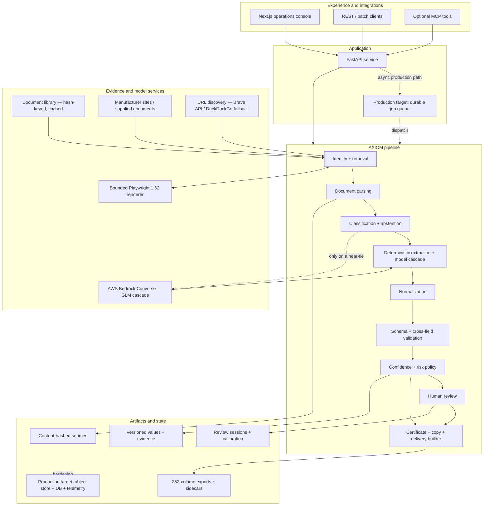

# UniHack Prototype Presentation Content

## AXIOM for UniLog — Verifiable Product Intelligence for Industrial Commerce

This file is designed for an AI presentation maker using:

`[EXT] UniHack-Protoype Template .pptx`

Use **On-slide content** as visible text. Put **Speaker notes / detailed answer** into presenter notes; do not overcrowd the slides. Preserve the supplied template order. Replace every `[TODO]` before submission.

---

## Master prompt for the AI PPT maker

Create a polished enterprise-technology presentation from the slide plan below while preserving the supplied UniHack template, slide order, and headings. Use a clean industrial-commerce visual language: navy and off-white foundations, teal for verified/publishable facts, amber for human-review items, gray for intentionally withheld values, and red only for rejected/invalid values. Prefer workflow diagrams, evidence cards, UI screenshots, and concise metric strips over stock photography. Use real application screenshots where requested; never fabricate a dashboard that could be mistaken for the working product.

The solution is **AXIOM**, the enrichment engine built for the UniLog use case. Its core message is:

> **From six sparse input fields to evidence-backed, reviewable, delivery-ready catalog data—without guessing.**

Keep on-slide text concise and move detailed explanations to speaker notes. Do not invent customers, revenue, deployment status, certifications, production scale, or accuracy. Never say “100% accurate” or “hallucination-free.” When showing evaluation results, display this qualifier directly beneath them:

> **Prototype backtest: 15 products, 312 comparisons; small labeled corpus, not a production guarantee.**

Use a repeated visual motif: a product attribute connected to an exact source quote, confidence score, validation status, and publication decision.

---

# Slide-by-slide presentation content

## Slide 1 — Guidelines

### Instruction

This is the organizer’s instruction slide, not solution content. Keep it unchanged while preparing the deck. Retain or remove it in the submitted version only according to the organizer’s rules.

---

## Slide 2 — Team Details

### Recommended slide title

**AXIOM**  
*Verifiable Product Intelligence for Industrial Commerce*

### On-slide content

- **Team name:** `[TODO: official team name]`
- **Team leader:** `[TODO: team leader’s full name]`
- **Challenge:** Minimal Product Information Enrichment
- **One-line pitch:** From six sparse input fields to evidence-backed, reviewable, delivery-ready catalog data—without guessing.

### Speaker notes / detailed answer

AXIOM is our working prototype for trustworthy industrial product-data enrichment. It accepts the incomplete records catalog teams commonly receive—manufacturer part number, short description, inconsistent brand fields, and manufacturer or supplier text—and converts them into normalized product intelligence with field-level provenance.

Unlike systems that optimize only for filling as many cells as possible, AXIOM treats **abstain, review, and withhold** as valid outcomes. A value enters downstream product copy and the delivery file only after it satisfies evidence, validation, and publication-policy requirements.

### Visual direction

Use a “before → after” composition:

- **Before:** a six-column sparse item-master row containing brand placeholders.
- **After:** normalized attributes with source, confidence, and status badges.
- Footer message: **Rich data is useful. Defensible data is publishable.**

---

## Slide 3 — Brief About Your Solution

### Recommended headline

**An evidence-gated compiler for product data**

### On-slide content

**Problem**  
Industrial item masters may contain only a part number, terse description, conflicting brand fields, and a supplier/manufacturer label. Commerce systems still require structured specifications, taxonomy, descriptions, URLs, and a rigid output contract.

**Solution**  
From a part number and a manufacturer alone, AXIOM searches the web for the manufacturer's own evidence, classifies the product, extracts schema-bound candidates, normalizes and validates them, scores confidence, and then accepts, reviews, rejects, or withholds each field.

**Output**  
A versioned product record, human-review queue, enrichment certificate, and exact **252-column UniLog delivery file** with per-cell provenance.

**Governing rule:** No independent evidence means no automatic publication.

### Speaker notes / detailed answer

The supplied sample input illustrates the challenge. It contains only these six fields:

1. `Mfg_Part_Num`
2. `Part_Desc`
3. `E1_Brand`
4. `Unilog_Brand`
5. `DIB_Brand`
6. `Part_Manuf`

Many brand cells are placeholders such as “Unbranded” or “No Unilog Brand,” while descriptions compress dimensions, grit, product form, and pack quantity into inconsistent free text.

AXIOM does not ask a language model to fill a spreadsheet in one step. It first resolves identity and obtains evidence. It classifies the product to select the correct schema, extracts only attributes defined for that class, normalizes and validates candidates, and applies a field-level confidence and risk policy. Only publishable values can be used to generate descriptions or populate delivery attributes. The system preserves exact evidence and explains deliberately blank cells.

The result is more than a richer row: it is a reproducible record of **what was found, where it came from, how it changed, why it was accepted, and what was intentionally withheld**.

### Visual direction

Show:

`Six-field row → evidence retrieval → governed attribute record → 252-column delivery + audit sidecar`

Under the governed record, show three outcomes: **Publish**, **Review**, **Withhold**.

---

## Slide 4 — Enrichment, Accuracy/Trust, and Enterprise Scale

### Recommended headline

**Enrich broadly. Publish selectively. Scale by configuration.**

### On-slide content: three-card layout

#### 1. Minimal input → rich intelligence

- **A part number and a manufacturer are enough**—retrieval finds the document.
- Four stages: stored library → manufacturer site → **Brave/open-web discovery** → bounded browser fallback.
- Retrieval is model-free: Brave when configured, keyless fallback otherwise.
- Exact or separator-normalized SKU coverage is required before evidence is accepted.
- Classify into the correct product schema—or abstain.
- Extract, normalize, and render delivery-ready fields.

#### 2. Accuracy and trust by design

- Exact source quote, document hash, and derivation per field.
- Unit, type, constraint, and cross-field validation.
- Confidence/risk policy: **accept, review, reject, withhold**.
- Human approval/correction and auditable certificates.

#### 3. Enterprise path

- Single-record API and batch item-master processing.
- Config-driven classes, attributes, rules, and output formats.
- Versioned values and deterministic delivery exports.
- Queue workers, durable storage, tenant controls, and observability as production hardening.

### Optional metric strip

**99.1% precision · 97.8% recall · 98.4% F1 · 100% citation coverage · 0 hallucinated outputs observed**

*Prototype backtest: 15 products, 312 comparisons; small labeled corpus, not a production guarantee.*

**80.2% of rows reachable with no search API · US$0.0004–$0.0006 per SKU in model spend**

*Retrieval coverage measured across 1,000 real item-master rows. Cost measured on 2 live single-SKU runs.*

### Detailed answer 1 — How does the solution enrich minimal product information?

AXIOM uses a staged workflow:

1. **Ingest minimal identity.** Accept a manufacturer part number and manufacturer, plus an optional description, brand, source URL, or source documents. Batch mode reads CSV, TSV, and XLSX item masters.
2. **Resolve identity signals.** Normalize the part number and reconcile brand/manufacturer information without silently treating a supplier or buying group as the actual manufacturer.
3. **Acquire evidence.** A part number and a manufacturer are sufficient—retrieval goes and finds the document through four bounded layers. It first checks the **content-addressed document library**; then tries declared manufacturer patterns, site discovery, and sitemaps; then uses **Brave Search URL discovery** when an API key is configured, automatically falling back to DuckDuckGo when it is not; finally, a **Playwright 1.62.0 fallback** renders JavaScript-dependent product pages only after static retrieval succeeds without proving exact SKU coverage. Search snippets are discarded—they are discovery hints, not citable evidence. Candidate capacity is reserved so sitemap fan-out cannot suppress open search, and repeated browser requests consume a separate hard cap. Every retained resource returns through the same final-URL policy, byte ceiling, content hashing, provenance, parsing, and exact/separator-normalized SKU gate. Marketplaces, mass retail, distributors, private-network targets, and disallowed redirects are refused before their content can support a claim. **No retrieval stage calls a model:** models process verified source artifacts only after retrieval.
4. **Parse content.** Convert text, HTML, tables, and optional PDF layouts into a common representation while preserving source context.
5. **Classify before extraction.** Rank candidate product classes from the description/document. If no class is defensible, abstain and skip extraction rather than inventing an attribute schema.
6. **Extract schema-bound candidates.** Combine deterministic structured extraction with a tiered AWS Bedrock model cascade (ZAI GLM: flash → mid → frontier). The cheapest tier runs first and escalates only when a validator rejects the output, so cost follows difficulty instead of a guess made before the call. A model response is only a candidate; it is not automatically published.
7. **Normalize.** Canonicalize quantities, units, ranges, enums, identifiers, and display formats.
8. **Validate.** Apply data-type, range, unit, required-field, and cross-field rules.
9. **Score and decide per field.** Assign confidence features and apply the risk policy to auto-accept, review, reject, or withhold each value independently.
10. **Generate only from accepted facts.** Build descriptions and features from publishable values so uncertain candidates cannot leak into product copy.
11. **Project to the client contract.** Map approved data into the exact 252-column UniLog format and create a sidecar explaining every populated and withheld field.

This can turn a terse abrasive-product description into normalized dimensions, grit, product form, pack quantity, brand/manufacturer identity, taxonomy, and channel descriptions—but only where independent evidence supports those values.

#### Implemented retrieval proof point — Mirka `9190153001`

A final hardened live smoke run started with only the SKU and manufacturer and automatically found Mirka's own product page at `https://www.mirka.com/en/p/9190153001/`. The retained evidence contained exact SKU `9190153001` plus `M14` and `Grip`. The run used **8 ordinary retrieval requests** and **41 browser subrequests across bounded render attempts**. No Brave credential was available, so the run used the automatic DuckDuckGo fallback and proves the manufacturer/open-web/browser path—not a live Brave API call. It ran against a temporary artifact store and did not overwrite the existing Mirka session or bundle. The full non-live Python suite, console typecheck, 222 console tests, production build, compile/Ruff checks, and final security review all passed.

Use this as a demo case, not as a universal accuracy claim: one successful SKU proves the execution path, while the broader evaluation metrics remain separately qualified.

### Detailed answer 2 — How does the solution ensure accuracy and trust?

AXIOM uses layered controls rather than trusting one model confidence number:

- **Evidence contract:** Extracted values must carry at least one evidence span: source document, quote, content hash, and page/location where available.
- **Quote verification:** The system records whether the quoted text can be matched to the source.
- **Input is not proof of itself:** A value parsed from the customer’s item-master description is useful as a candidate and retrieval hint, but it cannot auto-publish until an independent source confirms it.
- **Classification abstention:** If no product class is defensible, AXIOM returns an identity-only record rather than guessing a class or attributes.
- **Rule-based validation:** Types, units, ranges, enums, identifiers, constraints, and cross-field consistency are checked after normalization.
- **Confidence and calibrated policy:** Evidence and validation features feed a risk-controlled publication decision. A cold-start deployment defaults to review until automation has earned evidence.
- **Inference restrictions:** Part-number patterns, family inference, and statistical defaults cannot silently auto-publish; they require human approval.
- **Multi-source handling:** Sources can be compared and conflicts can be escalated instead of averaged into false certainty.
- **Human review:** Reviewers see the candidate, source quote, normalized value, confidence, and validations, then accept, correct, or reject it. Reviewer and timestamp are recorded.
- **Final publication gate:** High confidence alone is insufficient. Failed validation, missing verified evidence, self-declared input, or a non-publishable state keeps the value out of delivery output.
- **Audit artifact:** The enrichment certificate records lineage, validations, status, evidence, model tier, prompt/schema version, and reviewer information.

#### Defensible prototype evidence

The committed baseline evaluation reports:

- **15 products** and **312 comparisons**
- **222 correct**, **2 wrong**, **3 missed**, **85 correctly abstained**
- **0 hallucinated outputs observed in that harness**
- **99.1% precision**, **97.8% recall**, **98.4% F1**
- **95.05% exact match** and **100% citation coverage**

A separate classification artifact covers **1,000 rows across 32 classes**, reports **98% classification coverage**, and observed **0 fabricated class codes**. These figures are useful prototype evidence, but their datasets are not large enough to support universal or production guarantees.

### Detailed answer 3 — What makes the solution scalable for enterprise product catalogs?

The software boundaries are designed for scale, while production throughput remains a hardening goal:

- **Large catalogs:** Batch and single-item paths share the same enrichment and delivery logic. Stages are separable, so retrieval, extraction, validation, and export can become independent workers. A production deployment should replace the current synchronous/process-locked online path with durable queues, idempotent jobs, retries, and horizontally scalable workers.
- **New manufacturers:** Retrieval providers and source-authority rules are modular; aliases and domains can be added without touching extraction or delivery logic. This was measured rather than asserted. Across **1,000 real item-master rows**: 68.1% resolve to a declared manufacturer domain, 12.1% are already covered by the stored document library, so **80.2% are reachable with no search API at all**; a further 10.3% need either open-web search or one config entry (18 distinct undeclared manufacturers); and 9.5% name only a distributor, which **no search provider can fix**—that residue is a data-quality problem upstream, not a retrieval gap, and it is more honest to say so than to report it as a miss.
- **New product classes:** Classes, attributes, labels, slot bindings, constraints, and mappings are registry/config driven. New categories require schemas, examples, rules, and evaluation data—not a new application.
- **Different documents:** Item-master CSV/TSV/XLSX ingestion is separate from text, HTML, table, and PDF parsing. OCR/vision can be added upstream while preserving downstream governance.
- **Continuous updates:** Sources are content-hashed; values are versioned and superseded rather than overwritten; model, prompt, and schema versions are recorded. Changed sources can be reprocessed and audited as diffs.
- **Cost control:** Deterministic stages reduce unnecessary model calls, classification abstention can stop extraction early, a tiered cascade can reserve expensive models for ambiguity, and unchanged artifacts can be cached.
- **Enterprise operations:** The production target adds authentication, authorization, tenant isolation, quotas, egress policy, durable state, observability, retention controls, and per-tenant budgets.

Be explicit during presentation: modular batch processing and provider interfaces exist; high-volume distributed throughput, production SLOs, and secure multi-tenancy have not yet been load-proven.

### Visual direction

Use three numbered cards and a narrow metric strip. Keep the long answers in speaker notes. Add icons for **Evidence acquisition**, **Trust gate**, and **Scale-out architecture**.

---

## Slide 5 — Opportunities

### Recommended headline

**The missing trust layer between source documents and the PIM**

### On-slide content

#### Why existing approaches leave a gap

- **Manual research:** high judgment, but slow, inconsistent, and difficult to audit.
- **Rules/RPA only:** deterministic, but brittle across manufacturers and document formats.
- **Generic AI autofill:** fast and high-coverage, but can produce plausible unsourced specifications.
- **PIM/ERP:** manages approved data, but does not prove where every value originated.

#### Why AXIOM is different

| Approach | Automation | Field-level evidence | Knows when to stop |
|---|---:|---:|---:|
| Manual research | Low | Variable | Yes |
| Rules/RPA | Medium | Variable | Limited |
| Generic LLM autofill | High | Often weak | Often no |
| **AXIOM** | Hybrid | **Built into each value** | **Abstain/review/withhold** |

#### USP

> **Every field carries its own evidence, validation, confidence, and publication state—and the system knows when not to guess.**

### Detailed answer — How different is it from existing ideas?

AXIOM does not differentiate itself merely by using AI. Its difference is the governance contract around AI and deterministic extraction. The model is bounded by a selected product schema; exact evidence remains attached to individual values; the customer’s input cannot validate itself; uncertain values enter accountable review; and all delivery channels consume the same publishability decision. This prevents an API, UI, or exporter from applying a weaker trust rule.

### Detailed answer — How will it solve the stated problem?

- Sparse inputs trigger identity resolution and targeted evidence discovery.
- Classification selects the appropriate schema instead of extracting arbitrary fields.
- Hybrid extraction handles varied unstructured content.
- Normalization and validation convert source wording into consistent catalog data.
- Confidence policy automatically publishes the strongest facts and isolates exceptions.
- Human review handles uncertainty without returning the entire SKU to manual research.
- The delivery builder produces the exact requested format rather than stopping at generic JSON.
- Certificates and sidecars make the final output explainable to catalog, quality, and governance teams.

### Opportunity statement

AXIOM can become the trusted enrichment layer connecting manufacturer content to PIM, ERP, e-commerce, and marketplace workflows. The expected business outcomes are less research/re-keying, faster time-to-publish, higher independently verified completeness, and defensible catalog changes. These are **pilot hypotheses to measure**; the current repository does not prove customer adoption or ROI.

### Visual direction

Use a 2×2 matrix:

- X-axis: low to high automation
- Y-axis: low to high verifiability

Place generic AI at high automation/low verifiability and AXIOM at high automation/high verifiability. Label this as a **positioning hypothesis**, not an external benchmark.

---

## Slide 6 — List of Features Offered by the Solution

### Recommended headline

**A complete enrichment-to-publication workflow**

### On-slide content

#### Understand

1. CSV, TSV, and XLSX item-master ingestion
2. URL, text, HTML, table, and optional PDF ingestion
3. Part-number cleanup and brand/manufacturer resolution
4. **High-coverage retrieval: library, site/sitemap, Brave or keyless search, bounded browser fallback**
5. Robots, SSRF, redirect, request-count, byte, and source-authority gates
6. Exact SKU verification, immutable source hashing, candidate ranking, and class abstention
7. Deterministic extraction plus a tiered Bedrock model cascade

#### Govern

8. Unit, range, enum, identifier, and cross-field validation
9. Exact evidence quotes, source hashes, and per-field lineage
10. Confidence calibration and risk-budget policy
11. Accepted, review, rejected, withheld, and superseded states
12. Human accept/correct/reject workflow and decision history
13. Certificates, quality indicators, and regression evaluations

#### Deliver

14. Descriptions generated only from publishable facts
15. Exact 252-column UniLog XLSX/CSV/JSON export
16. Per-cell sidecar for populated and withheld output
17. Single-record enrichment and batch delivery APIs
18. Enrich, pipeline, review, quality, certificate, and delivery screens

### Speaker notes / detailed answer

The signature feature is the publication boundary. Extraction discovers candidates, but discovery does not equal approval. Each `AttributeValue` carries raw and canonical values, derivation method, confidence, lifecycle status, evidence, validation results, schema/model/prompt versions, and review information. The UI, certificate, and delivery exporter therefore use one trust definition.

The delivery layer is not a basic format conversion. It knows whether a column is passthrough, derived, extracted, generated, or unavailable; preserves declared column order; keeps unsupported values blank; applies output constraints; and explains the result in a sidecar.

### Visual direction

Use three columns—**Understand, Govern, Deliver**—and highlight **field-level provenance** plus **252-column delivery**.

---

## Slide 7 — Process Flow / Use-Case Diagram

### Recommended headline

**From sparse record to governed publication**

### Diagram for the AI PPT maker

```mermaid
flowchart LR
    A[Six-field item-master row] --> B[Resolve product identity]
    B --> C{Evidence supplied?}
    C -->|Yes| D[Ingest URL / PDF / HTML / text]
    C -->|No| E["Retrieve — library, mfr site/sitemap, then Brave or keyless search"]
    E --> E2{"Policy + SSRF + request budgets"}
    E2 -->|Refused, or nothing found| H
    E2 -->|Allowed| E3{Exact SKU evidence?}
    E3 -->|Yes| F
    E3 -->|No; JavaScript shell| E4["Bounded Playwright render + PDF-link discovery"]
    E4 --> E5{Exact SKU evidence?}
    E5 -->|Yes| F
    E5 -->|No| H
    D --> F[Parse + hash exact source]
    F --> G{Classify product}
    G -->|No defensible class| H["Abstain — identity-only record"]
    G -->|Class selected| I[Schema-bound extraction]
    I --> J[Normalize units, enums, ranges]
    J --> K[Validate fields + cross-field rules]
    K --> L[Confidence + risk policy]
    L -->|Verified and above threshold| M[Auto-accept]
    L -->|Uncertain / conflicting| N[Human review]
    L -->|Invalid / unsupported| O[Reject or withhold]
    N --> P[Accept, correct, or reject]
    M --> Q[Certificate + descriptions]
    P --> Q
    O --> Q
    H --> Q
    Q --> R[252-column delivery + provenance sidecar]
    P -.review outcomes.-> S[Update priors / recalibrate policy]
    S -.versioned future policy.-> L
```

### On-slide callouts

- **Machine:** retrieve, parse, classify, extract, normalize, validate, score.
- **Human:** resolve only uncertain or conflicting exceptions.
- **Where the model is:** extraction always, classification only on a near-tie. **2 of 9 stages.**
- **Where it is not:** retrieval, parsing, normalization, validation, scoring, delivery.
- **Promise:** unsupported candidates never enter generated copy or published output.

### Use-case statement

- **Actor:** Catalog operations specialist
- **Trigger:** A sparse supplier item-master file arrives.
- **Goal:** Produce import-ready UniLog data with evidence and an exception queue.
- **Success:** Every published value is traceable; every uncertain value is reviewable or explicitly withheld.

### Speaker notes / detailed answer

Decisions happen at field level. One SKU can contain ten well-supported facts and two ambiguous ones; AXIOM can publish ten and isolate two without either rejecting the whole record or accepting everything. Human outcomes update priors/calibration under a versioned process. Do not describe this as automatic model-weight training; a future fine-tuning workflow would require explicit datasets, holdout evaluation, versioning, rollback, and audit.

Worth stating plainly if asked, because it is the line most audiences get backwards: **a model reads documents; arithmetic decides what to trust.** Only two stages call a model. Extraction always does. Classification does so *only* when candidate ranking produces a genuine near-tie—when the leading class dominates, the answer is returned deterministically and no call is made. Retrieval, parsing, normalization, validation, scoring, certification, and delivery contain no model call at all. So the publication decision—the one that actually determines what a customer receives—is made by a calibrated policy with a statistical error bound, not by a model's self-reported confidence.

**That claim is enforced by a test, not just documented.** One case asserts the set of model-calling stages is exactly `["classify", "extract"]`; another walks `validate`, `decide`, `certify`, and `syndicate` and fails if a model ever appears on any of them. Both run in CI. If someone later routes a publication decision through a model, the build breaks and names the reason. This is a good answer to “how do we know the boundary is real?”—it is checked on every commit rather than asserted in a slide.

### Visual direction

Render left to right. Teal = auto-accept, amber = review, gray/red = withhold/reject. Use a dotted feedback arrow for review outcomes.

---

## Slide 8 — Wireframes / Mock Diagrams

### Recommended headline

**Designed for evidence-first decisions**

### On-slide content: four frames

#### 1. Submit — `/enrich`

- MPN, manufacturer, description, source URL, optional class
- Retrieval and model-call disclosure
- Run governed enrichment

#### 2. Verify — `/review/[sku]`

- Left: exception queue, status, confidence
- Center: source document and highlighted quote
- Right: normalized value, validations, derivation, **Accept / Correct / Reject**

#### 3. Prove — `/certificates/[sku]`

- Identity and selected class
- Value lineage and evidence hash
- Validations, versions, quality indicators, reviewer history

#### 4. Publish — `/delivery`

- Upload item master and optional documents
- Preview populated and withheld columns
- Export XLSX, CSV, or JSON with audit sidecar

### Speaker notes / detailed answer

The review workspace makes evidence—not the generated answer—the visual center. A reviewer should immediately know: **What is proposed? Where did it come from? Why did it require review?** The certificate serves quality/audit users, while the delivery view makes the workflow operational: upload, inspect, and export contract-correct data.

### Visual direction

Use actual screenshots if possible. If screenshots are not ready, create clearly labeled grayscale wireframes, not fake photorealistic product screens. Caption the journey: **Submit → Verify → Prove → Publish**.

---

## Slide 9 — Architecture Diagram

### Recommended headline

**Modular intelligence with a hard governance boundary**

### Diagram for the AI PPT maker

### On-slide labels

1. **Experience:** Next.js console, REST/batch, optional MCP
2. **Application:** FastAPI validation and orchestration
3. **Intelligence:** retrieval, parsing, classification, hybrid extraction
4. **Governance:** normalization, validation, confidence, review
5. **Artifacts:** hashes, versioned values, certificates, exports

### Speaker notes / detailed answer

Candidate generation and publication are intentionally separate. Retrieval and models can propose facts; only governance can authorize them for downstream use. The delivery builder uses the same publishability property as the console and certificate, so no output channel can silently bypass evidence and validation.

Note the two edges into Bedrock, because they are not equivalent. Extraction always calls a model. Classification calls one **only on a near-tie**—hence the dotted edge—and returns deterministically the rest of the time. Nothing in evidence acquisition calls a model. Retrieval uses a hash-keyed library, manufacturer patterns/site maps, URL-only search discovery, and a bounded renderer. Brave titles and snippets are discarded; only bytes fetched from the final source URL can become evidence. Static discovery/candidate requests and browser subrequests have separate ceilings so a large sitemap or polling page cannot silently consume unlimited work.

Implemented components include the FastAPI service, Next.js console, provider interfaces, file-backed prototype artifacts, evaluation harnesses, and AWS CDK definitions. Components drawn as **production target** are roadmap hardening and should not be presented as deployed or load-tested.

### Visual direction

Use five horizontal layers. Draw a bold boundary before publication labeled:

> **Nothing crosses into delivery without evidence + policy.**

Use dotted outlines for target production components.

---

## Slide 10 — Technologies Used in the Solution

### Recommended headline

**A typed, testable, cloud-ready stack**

### On-slide content

| Layer | Technologies | Role |
|---|---|---|
| Core | Python 3.11+, Pydantic 2.13.4, PyYAML | Typed values, schemas, rules, provenance |
| API | FastAPI 0.141.1, Uvicorn 0.34.0 | Enrichment, batch delivery, review endpoints |
| AI/cloud | AWS Bedrock Converse — ZAI GLM-4.7-flash / GLM-4.7 / GLM-5, Qwen3-VL (vision), boto3 1.40.15 | Tiered cascade; used by 2 of 9 stages |
| Retrieval | Brave Search API, DuckDuckGo fallback, Playwright 1.62.0, `robots.txt`, URL/SSRF policy | URL-only discovery plus bounded JavaScript rendering |
| Data/docs | pdfplumber, openpyxl, Python CSV/HTML tools, content-addressed artifacts | PDF, XLSX, CSV/TSV, HTML ingestion and immutable provenance |
| Console | Next.js 16.2.12, React 19.2.8, TypeScript 7.0.2, Tailwind CSS 4.3.3 | Review, quality, certificate, delivery UI |
| Integration | REST, optional MCP 2.0 | Human and agent workflows |
| Quality | pytest, Vitest, Ruff, evaluation/regression harnesses | Backend, UI, lint, behavior gates |
| Delivery/infra | Docker/Compose, GitHub Actions, AWS CDK definitions | Reproducible packaging, CI, and infrastructure as code |

### Speaker notes / detailed answer

The architecture is hybrid by design. Pydantic provides strict domain models; YAML-backed schemas make classes and rules inspectable and versionable; FastAPI exposes the same pipeline used by offline scripts; and Next.js provides operational review and audit views.

Deployment wiring now installs the API with its browser/document extras, pins Playwright `1.62.0`, installs Chromium into the container, and exposes `AXIOM_SEARCH=auto`, `AXIOM_BROWSER=auto`, and the optional Brave key through Compose. Present this as **configured packaging**, not a verified image: Docker was not available in the local validation environment, so the container build remains an explicit pre-demo check.

AWS Bedrock is an optional bounded component, not the whole solution. Deterministic parsing, normalization, validation, policy, and delivery remain first-class. The offline batch delivery path can operate without model credentials; online enrichment uses real model calls when configured.

**On the specific models, since judges usually ask.** The text cascade runs entirely on ZAI GLM through the Bedrock Converse API in `us-east-2`: `zai.glm-4.7-flash` at the volume tier, `zai.glm-4.7` at mid, `zai.glm-5` at frontier, with `qwen.qwen3-vl-235b-a22b` reserved for vision. Every ID in `config/models.yaml` is generated by a preflight script that verifies it with a live call, so the config records what actually answered rather than what the catalogue advertises. Escalation is triggered by a **validator rejecting the output**, not by a difficulty guess made before the call—the cheap tier is tried first and only a genuinely unusable response costs more.

Two things worth being precise about rather than glossing. This account has **no entitlement to OpenAI or Anthropic models**, so the stack was built on what was actually available; because only two stages call a model, that constraint changed the model IDs and nothing about the architecture. And an embedding model is pinned in config but **never invoked**—classification uses lexical candidate scoring, not vector similarity. Do not claim semantic search.

### Visual direction

Use a stack grid with **Hybrid by design** in the center, connecting deterministic, AI-assisted, and human-review elements.

---

## Slide 11 — Estimated Implementation Cost (Optional)

### Recommended headline

**Low-cost prototype; usage-based production path**

### On-slide content

#### Planning estimate — not a vendor quote

| Area | Basis | Estimate |
|---|---|---:|
| Hackathon demo | Existing code, local console/API, limited model usage | **US$25–$100 total usage** |
| Production pilot build | 4-person team, 8–12 weeks, security/integration hardening | **US$40k–$100k one-time** |
| Pilot cloud operations | API/workers, storage, DB, logs and monitoring | **US$300–$1,500/month** |
| AI inference — **measured** | 2 live single-SKU runs, 1 model call each | **US$0.00039–$0.00065/SKU** |
| AI inference — modelled ceiling | Escalation to frontier tier + copy generation | **~US$0.02/SKU** |
| 100k-SKU first pass | Inference only, at the measured rate | **~US$40–$65** |
| Search / retrieval | Library/site paths are free; DuckDuckGo fallback is keyless; Brave follows account pricing | **US$0 fallback / provider-dependent API usage** |

**Cost controls:** deterministic first, abstain early, tiered cascade, cache sources by content hash, process only changes, and review only exceptions.

### Speaker notes / assumptions

The project uses open-source application dependencies, so there is no mandatory application license. The repository’s AWS Bedrock price table, generated on 3 August 2026 for on-demand rates, spans US$0.07/M input and US$0.40/M output on the flash tier (`zai.glm-4.7-flash`) to US$1.00/M input and US$3.20/M output on the frontier tier (`zai.glm-5`).

**The per-SKU figures are measured, not modelled**, which is a meaningfully stronger claim than this slide previously made. Two live runs against the real account:

- Kichler `43911BK` — 1 model call, **US$0.000391**, 3 cited values, 100% citation coverage
- Frigidaire `PDSH4816AF` — 1 model call, **US$0.000645**, 8 cited values, 100% citation coverage

One call rather than two in both cases, because candidate ranking resolved the product class decisively and classification never reached the model. Both stayed on the flash tier with no escalation. Actual token usage came in well below the 12,000-input/2,000-output figure this slide used to assume, which is why the measured cost is roughly an order of magnitude under the earlier estimate.

Retrieval added **no inference cost** in either measured model run: the Kichler document was already in the library (zero network requests), and the Frigidaire document was found by keyless open-web search. The current provider mode is `auto`: it selects Brave when `AXIOM_BRAVE_API_KEY` is available and falls back to DuckDuckGo otherwise. No live Brave cost or latency measurement is claimed because the validation environment did not contain a Brave key.

Keep the modelled ~US$0.02/SKU ceiling on the slide, because it is the honest upper bound when a response fails validation and escalates to the frontier tier and copy generation is enabled. State the caveat: **two SKUs is a measurement, not a distribution.** The range excludes retries, unusually large documents, OCR, data transfer, taxes, support, and human review. The engineering estimate covers authentication, authorization, tenant controls, queues, durable storage, connectors, observability, security review, deployment, and evaluation expansion. A pilot should still measure reviewer minutes, exception rate, latency, and cost per publishable field across a full catalogue.

### Visual direction

Separate **one-time engineering** from **variable per-SKU operations**. Display assumptions directly beside the cost range.

---

## Slide 12 — Snapshots of the MVP

### Recommended headline

**A working workflow—not just a model demo**

### Screenshot plan

1. **Submit — `/enrich`**  
   “Enter MPN, manufacturer, description, or a source URL and run governed enrichment.”

2. **Trace — `/pipeline`**  
   “Inspect classification, extraction, normalization, validation, confidence, and publication stages.”

3. **Resolve — `/review/[sku]`**  
   “Open exact evidence and accept, correct, or reject an uncertain field.”

4. **Prove — `/certificates/[sku]`**  
   “See lineage, hashes, validations, versions, review history, and quality indicators.”

5. **Publish — `/delivery`**  
   “Upload the sparse item master and download the 252-column XLSX/CSV plus provenance.”

6. **Optional Measure — `/quality`**  
   “Track completeness, verifiability, abstention, and policy behavior.”

### Speaker notes / detailed answer

The MVP supports the complete user journey: submit a single product or batch file, inspect processing stages, resolve uncertain values, review a certificate, and produce contract-correct delivery output without re-running the model during download.

Use Mirka `9190153001` across the retrieval screenshots because it demonstrates the newly implemented path with minimal input. Start with only the SKU and manufacturer, show automatic retrieval reaching Mirka's own `en/p/9190153001/` page, open the exact SKU/product evidence, then continue through class, attributes, review, certificate, and delivery preview. Keep one intentionally withheld field: a blank supported by an explanation demonstrates trust, not failure. If a later stage uses fixture data rather than the live Mirka run, label that screen explicitly.

### Screenshot checklist

- Use the same SKU throughout.
- Keep browser zoom and crop readable in the deck.
- Hide credentials, tokens, personal data, and local file paths.
- Label fixture-backed views as **fixture-backed prototype view**.
- Do not present an unclassified record’s vacuous completeness value as 100%; treat it as unmeasured.

### Visual direction

Create a numbered journey: **1 Submit → 2 Trace → 3 Resolve → 4 Prove → 5 Publish**. Include a narrow “before” strip showing the source CSV row.

---

## Slide 13 — Additional Details / Future Development

### Recommended headline

**Roadmap: trusted prototype to production catalog infrastructure**

### On-slide content

#### 0–3 months — Harden and measure

- Authentication, authorization, tenant isolation, quotas, and audit logs
- Durable async jobs, retries, idempotency, and controlled egress
- Expand live browser-retrieval evaluation across more manufacturers and portal patterns
- Source-change detection and retrieval snapshots
- Validate the container image and live Brave provider in a credentialed environment
- Larger independently labeled, class-stratified evaluations

#### 3–6 months — Integrate and scale

- PIM/ERP and supplier-feed connectors
- Object storage, database-backed state, tracing, metrics, alerts, and SLOs
- Reviewer productivity analytics and active calibration
- More classes, manufacturers, and tested delivery channels

#### 6–12 months — Governed intelligence

- OCR/vision for scans and image-heavy documents
- Multilingual extraction and localization policies
- Change monitoring and evaluated product-family/equivalence workflows
- Versioned fine-tuning only with approved data, holdouts, audit, and rollback

### Pilot success metrics

- Precision and citation coverage by class
- Independently verified completeness
- Auto-accept, review, reject, and withhold rates
- Reviewer minutes and correction rate per SKU
- Time-to-publish and cost per publishable field
- Source freshness and update latency

### Speaker notes / detailed answer

The first priority is not more generation; it is stronger execution and evidence: secure access, controlled network egress, durable jobs, tenant budgets, retention, observability, and much larger independent evaluation datasets. The prototype’s synchronous online path and process-level lock are appropriate for demonstration, not proof of enterprise throughput.

Review feedback currently records decisions and can update priors/calibration. It should not be marketed as autonomous “self-learning” or model-weight training. Any future training pipeline must be explicit, versioned, holdout-tested, reversible, and auditable.

### Honest current limitations for Q&A

- The primary backtest contains 15 products; extraction and delivery evaluation sets are also small.
- Per-SKU cost is measured on **two** live runs. It is a real measurement, not a distribution across a catalogue.
- No customer adoption, external competitor benchmark, production SLO, or high-volume load test is proven.
- The current API lacks built-in production authentication and must not be exposed publicly as-is.
- Brave Search is implemented as the preferred URL-discovery provider, but the validation environment had no Brave API key; live Brave behavior and cost remain unverified. `auto` mode falls back to DuckDuckGo's public HTML interface, which has no availability guarantee.
- Playwright rendering is request- and byte-bounded, blocks WebSockets, measures DOM output in an isolated browser world, and accepts downloads only when they bind unambiguously to a successful observed PDF response. This conservative policy intentionally discards repeated/ambiguous download URLs and requires Chromium, so the browser path has higher latency than static retrieval.
- Docker/Compose deployment wiring is present, including Chromium installation, but the image was not built locally because Docker was unavailable in the validation environment.
- About 9.5% of measured rows name only a distributor, never a manufacturer. No search provider can resolve those; they need better upstream data.
- An embedding model is pinned in config but never called. Classification is lexical, not semantic.
- The strongest implemented output is the fixed 252-column UniLog contract; universal PIM/channel compatibility is future work.
- Live and fixture-backed console data must be labeled accurately.

### Visual direction

Use three roadmap horizons with measurable gates. Place **Trust before coverage** above the timeline.

---

## Slide 14 — Repository, Demo Video, and Working Prototype Links

### Recommended headline

**Explore the code, demo, and prototype**

### On-slide content

- **GitHub public repository**  
  `https://github.com/varshith21-codes/Unilog`  
  `[TODO: verify it is public and accessible while signed out]`

- **3-minute demo video**  
  `[TODO: paste public/unlisted video URL]`

- **Working prototype**  
  `[TODO: paste deployment URL, or write “Local working prototype — live walkthrough provided”]`

- **Contact**  
  `[TODO: team email/leader contact if permitted]`

### Closing line

> **AXIOM turns minimal product data into trusted catalog intelligence—and shows its work.**

### Speaker notes / detailed answer

Do not invent a deployment URL. If the application is local, state that clearly and use the recorded demo. Test all links in a signed-out/incognito browser. Generate QR codes only after confirming access, and print the raw URL below every QR code.

### Visual direction

Use three QR cards: **Repository**, **Demo**, and **Prototype**.

---

## Slide 15 — Optional Closing / Q&A

The template’s fifteenth slide is blank. If extra slides are allowed, use it as a restrained closing slide.

### On-slide content

**From minimal data to trusted catalog intelligence.**

**Retrieve → Verify → Review → Publish**

`[TODO: team name]` · `https://github.com/varshith21-codes/Unilog`

### Visual direction

Show one attribute linked to one exact source quote and one green **Publishable** badge. Add no new claims.

---

# Three-minute demo video script

## 0:00–0:20 — Problem

> “Industrial catalog teams receive records like this: a part number, a short description, placeholder brand fields, and a supplier or manufacturer label. Downstream commerce still expects structured specifications, descriptions, source URLs, and a strict 252-column delivery file. Manual research is slow, while unconstrained AI can produce plausible but unsupported data.”

**Show:** one sample six-field CSV row.

## 0:20–0:40 — Solution

> “AXIOM is an evidence-gated enrichment pipeline. It retrieves or accepts manufacturer evidence, classifies the product, extracts only schema-bound fields, normalizes and validates every candidate, and decides field by field whether to publish, review, or withhold.”

**Show:** the pipeline overview.

## 0:40–1:10 — Submit and process

> “We submit two fields—a part number and a manufacturer. AXIOM checks its content-addressed library, manufacturer patterns and site maps, then URL-only web discovery—Brave when configured, with a keyless fallback. If a static product page is only a JavaScript shell, a separately capped Playwright fallback renders it and discovers source documents. Search snippets are never treated as evidence; the exact source bytes must contain the SKU before the pipeline proceeds.”

**Show:** `/enrich` with Mirka `9190153001`, description and URL left empty; then show the retrieved Mirka product evidence and `/pipeline`.

*Presenter note: leaving the optional fields blank is the strongest version of this demo. Filling them in makes it look like the operator did the research.*

## 1:10–1:45 — Trust and human review

> “A model answer is never published just because it sounds right. Each candidate keeps its source quote, derivation method, normalized value, validation results, confidence, and status. Here, this field needs review. The reviewer can inspect the exact evidence and accept, correct, or reject it. Unsupported fields stay blank.”

**Show:** `/review/[sku]`; complete one decision.

## 1:45–2:15 — Certificate

> “The certificate records what was accepted, where it came from, how it was validated, and which schema, prompt, model tier, or reviewer was involved. This makes the enrichment reproducible and auditable.”

**Show:** `/certificates/[sku]` and one evidence entry.

## 2:15–2:40 — Delivery

> “Finally, AXIOM projects only publishable values into the exact 252-column UniLog contract and creates a sidecar that explains both populated and withheld cells. We can download XLSX or CSV without paying for another model run.”

**Show:** `/delivery`, preview, and download controls.

## 2:40–3:00 — Evidence and close

> “In our small 15-product prototype backtest, AXIOM reported 99.1% precision, 97.8% recall, 98.4% F1, and full citation coverage, with no hallucinated outputs observed in that harness. These are prototype results, not production guarantees. AXIOM’s promise is simple: enrich aggressively, but publish only what can be defended.”

**Show:** qualified metric strip and final tagline.

---

# Suggested judge Q&A answers

## “Which AI models are you actually using, and where?”

The text cascade is ZAI GLM on AWS Bedrock Converse in `us-east-2`—`glm-4.7-flash` at the volume tier, `glm-4.7` at mid, `glm-5` at frontier—with `qwen3-vl` held for vision work. Every pinned ID was verified with a live call by a preflight script, not taken from the model catalogue.

The more useful half of the answer is *where* they run. **Two of nine stages call a model.** Extraction always does. Classification does so only when candidate ranking produces a near-tie; when one class dominates, the answer is deterministic and costs nothing. Retrieval, parsing, normalization, validation, scoring, certification, and delivery make no model call whatsoever.

So the framing is: **a model reads documents; arithmetic decides what to trust.** Nothing is published because a model sounded confident—it is published because a calibrated policy with a stated error bound cleared it. That is also why the model choice is swappable: this account has no OpenAI or Anthropic entitlement, and working within that changed the model IDs and nothing about the architecture.

## “Are you paying for a search API? What happens when it breaks?”

Not necessarily. AXIOM now supports the Brave Search API as the preferred production discovery provider, but keeps an automatic keyless DuckDuckGo fallback. On the measured 1,000-row sample, **80.2% are reachable without any search provider at all** through the stored library or a declared manufacturer domain. Brave pricing applies only when an operator configures a Brave key; we do not claim a live Brave cost measurement yet.

The provider interface is deliberately one method wide: query in, ranked URLs out. Titles and snippets are discarded because they are not source evidence. A provider timeout or missing key becomes an explicit diagnostic and falls back rather than aborting enrichment. Resolver capacity is reserved so manufacturer sitemap work cannot crowd out a search-derived candidate, and a bounded Playwright step is available only when static evidence still fails exact SKU coverage.

## “Why not use a general-purpose LLM with a spreadsheet prompt?”

A spreadsheet prompt can create high apparent fill, but it does not reliably enforce product-class schemas, source authority, exact field-level citations, normalized units, cross-field constraints, lifecycle state, or a deterministic output contract. AXIOM can use a model where it adds value, but the model operates inside an evidence and validation system.

## “What happens when the system cannot find enough evidence?”

It abstains, queues the field for review, or withholds it from delivery. It does not use the customer’s own description as independent proof. A blank with a reason is safer than a plausible specification that cannot be defended.

## “How does human feedback improve the system?”

Review outcomes are recorded and can update source/attribute priors and confidence calibration under versioned policy. The current implementation does not autonomously retrain model weights. Governed fine-tuning is future work.

## “Can it process a million SKUs?”

The batch engine and modular stages provide the right decomposition, but million-SKU throughput has not been load-tested. Production scale requires queue-backed workers, idempotency, retries, caching, durable storage, rate/budget controls, and observability. We present that as the deployment path, not as a completed benchmark.

## “How is this different from a PIM?”

A PIM stores and distributes approved product information. AXIOM focuses on converting sparse records and source documents into evidence-backed candidates, governing publication, and producing traceable delivery data. It complements a PIM rather than replacing all PIM workflows.

## “Is the system hallucination-free?”

No responsible system should make that universal claim. AXIOM is designed to reduce and expose fabrication risk through bounded extraction, exact evidence, validation, abstention, human review, and withholding. The current small baseline observed zero hallucinated outputs; that is a scoped test result, not a guarantee.

## “What is the production security posture?”

The prototype includes input limits and URL safety checks, but its API does not yet have production authentication or tenant controls. Before public deployment we would add identity, authorization, quotas, tenant isolation, egress policy, managed secrets, audit logs, retention controls, and abuse monitoring.

---

# Final replacement checklist

Replace or confirm all of the following before giving the file to the AI PPT maker:

- `[TODO: official team name]`
- `[TODO: team leader’s full name]`
- GitHub repository is public while signed out
- 3-minute demo video URL
- Working prototype URL or explicit local-prototype statement
- Contact information, if allowed
- Real MVP screenshots captured from the same SKU
- Fixture-backed screens labeled correctly
- Every metric includes its dataset qualifier
- No claim of customers, production deployment, guaranteed accuracy, universal scale, or hallucination-free operation

# One-sentence closing summary

**AXIOM transforms sparse industrial product records into evidence-backed, reviewable, delivery-ready catalog intelligence, while making abstention and traceability first-class parts of automation.**
