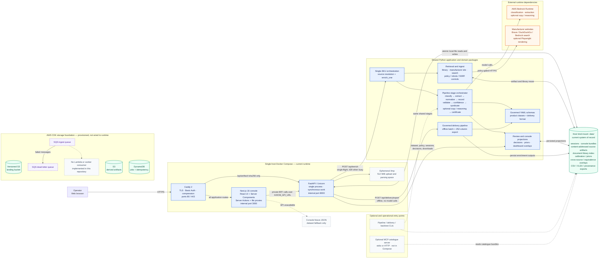

# AXIOM / Unilog Architecture

This diagram describes the architecture implemented in this repository. Solid arrows are live runtime paths. Dashed arrows are optional tooling, fallback behavior, or infrastructure that is provisioned but not connected to the current application.

## Key architectural constraints

- **Next.js is the browser-facing BFF.** Server Components, Server Actions, and route handlers call FastAPI on the private Compose network. The only browser-to-FastAPI exception is the hash-addressed artifact route proxied by Caddy.
- **The API is deliberately single-process.** Enrichment runs synchronously under a process mutex; there is no live queue, background worker, Redis, or SQL database.
- **The bind-mounted `data/` directory is the current system of record.** It holds mutable review sessions, immutable/content-addressed sources, dashboard projections, calibration state, and delivery outputs.
- **Online and offline paths share domain code.** HTTP enrichment and operational CLIs converge on the same staged Python pipeline; upload-based delivery uses the deterministic governed delivery package and does not call Bedrock.
- **The CDK resources are future foundation.** S3, DynamoDB, SQS, and the DLQ are defined, but the current API and pipeline have no adapters or consumer connecting them.

## Primary implementation references

- Runtime topology: [`compose.yaml`](../compose.yaml) and [`deploy/Caddyfile`](../deploy/Caddyfile)
- API and persistence boundaries: [`apps/api/main.py`](../apps/api/main.py)
- Console BFF actions and loaders: [`apps/console/src/lib/actions.ts`](../apps/console/src/lib/actions.ts) and [`apps/console/src/lib/data.ts`](../apps/console/src/lib/data.ts)
- Enrichment and pipeline orchestration: [`packages/axiom/pipeline/single.py`](../packages/axiom/pipeline/single.py) and [`packages/axiom/pipeline/stages.py`](../packages/axiom/pipeline/stages.py)
- Future AWS storage foundation: [`infra/lib/storage-stack.ts`](../infra/lib/storage-stack.ts)
